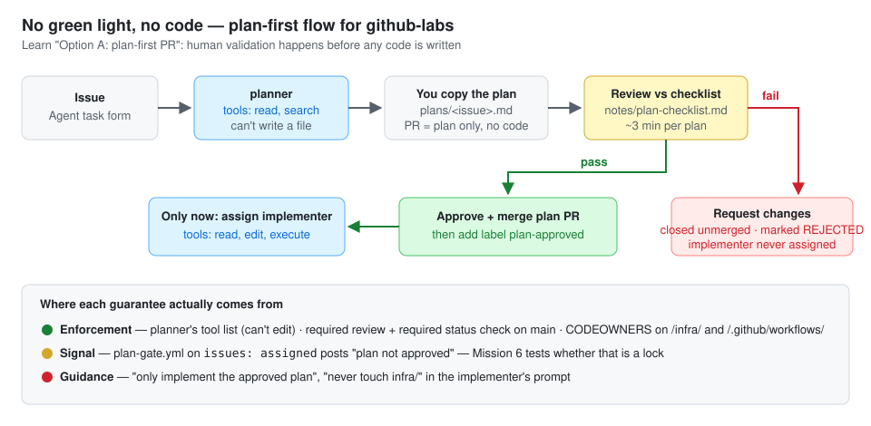

# Day 4 — No green light, no code

> Today a plan has to earn a merge before any implementer is called. By tonight you can show a plan that was **rejected and never reached execution**.

**Deliverable:** `plans/` with one approved and one rejected plan · `notes/plan-checklist.md` · `plan-approved` gate (workflow or documented manual gate)

## Bets

- **Bet A** — The label-check workflow runs on `issues: assigned`. When Copilot is assigned without `plan-approved`, does the workflow **stop Copilot from starting**? **My guess: No, it only comments; the session still starts**
  - Result: **Hit** — actual: the comment posted **and** the implementer session started anyway. A workflow on `issues: assigned` reacts *after* the assignment: it can signal, not lock

## Lessons (Mission 1 — Plan-first vs plan + execution)

Source: [Learn — Separate planning, reasoning, and execution](https://learn.microsoft.com/en-us/training/modules/design-agent-architecture-integration/4-plan-reason-execution#option-a-plan-first-pull-request)

| | Option A: plan-first PR | Option B: plan + execution |
|---|---|---|
| What the PR holds | **Only the plan**, no code | Plan in the PR description **plus** commits |
| When humans validate | **Before** any code is written | Code first; validation still required **before merge** |
| Where the risk sits | Reduced early exposure | Earlier exposure: wrong/unneeded code to review and reject, more reviewer effort, plan/code drift |
| Use when | High-risk or hard to reverse, intent alignment critical, strict separation wanted | Speed matters, low-risk / easily reversible, reviewers OK judging plan + code together |

- The choice is **not whether** work is reviewed (it always is) but **when** code is allowed relative to human validation
- Either option is safe *if* GitHub protections are configured; Option B's risk lives in the proposal stage, not after merge
- Decision rule: plan-first for **workflows, infra, auth, production** → in this repo: screening rules, thresholds, `infra/`, `.github/workflows/`

Source: [Learn — Pull requests are architectural control points](https://learn.microsoft.com/en-us/training/modules/design-agent-architecture-integration/5-pull-request-governance-controls#pull-requests-are-architectural-control-points)

- Safe flow: agent creates branch → opens PR **with plan** → **required reviews** validate approach → **required checks** run → merge only when **both** pass

**When is plan-first worth the extra step?** When the change is **high-risk or hard to reverse**: screening rules, thresholds, workflows, `infra/`, auth. Then I want to review intent before any code exists; low-risk fixes can go plan + execution.

## Lessons (Mission 2 — Turning "please plan" into a guarantee)

Source: [Learn — PR template that requires a structured plan](https://learn.microsoft.com/en-us/training/modules/design-agent-architecture-integration/5-pull-request-governance-controls#implementation-pr-template-that-requires-a-structured-plan)

- Template **Plan** section: Goal · Scope (paths/files) · Steps · Success criteria (verifiable) · Risks + mitigations · **Rollback / escalation plan**; plus **Evidence** (workflow runs, scan results) and a review checklist
- A template only *asks*. A plan-gate workflow marked as a **required status check** (ruleset / branch protection) turns "include a plan" into a **system guarantee**
- Learn also notes GitHub can require **explicit approval before workflows run** on agent-generated changes

> ⚠️ **Correction — don't copy the Learn plan-gate as-is.** Its script checks that `Github/pull_request_template.md` exists in the checkout. That proves the *template* exists (and the real path is `.github/…`), not that *this PR* contains a plan. A useful gate checks the PR's **changed files** for `plans/<issue>.md`.

Source: [Learn — Using CODEOWNERS to ensure safety](https://learn.microsoft.com/en-us/training/modules/design-agent-architecture-integration/5-pull-request-governance-controls#using-codeowners-to-ensure-safety)

- CODEOWNERS routes `/security/`, `/.github/workflows/`, `/infra/` to the right team; **only blocks merges when combined with required review**
- An agent that can bypass checks or merge without review is a **workflow design failure**, not a model problem

- Tried Learn's template as `.github/pull_request_template.md`, then **dropped it**: its Plan section duplicates `plans/<issue>.md` (and in a different shape), and a template is only **guidance** until a required check verifies it

**Three enforcement points:** ① required review ② required status check ③ CODEOWNERS (+ required review)

**My plan template vs Learn's:** mine has *Tests to add* and *Out of scope*; Learn's has *Success criteria*, *Rollback / escalation* and *Evidence*. Decision → adopt all three: **Success criteria** (verifiable), **Rollback / escalation**, and **Evidence to attach** (the plan names the evidence; the *implementation* PR attaches it, since no runs exist before code). Planner goes from 6 → 9 sections: Goal · Files to change · Steps · Tests to add · Success criteria · Risks · Rollback / escalation · Evidence to attach · Out of scope

## Mission 3 — Plan checklist

→ [`notes/plan-checklist.md`](plan-checklist.md)

## Mission 4 — Plan lands in a PR

- Route chosen: **(a) keep the planner read-only**; I copy its plan into `plans/<issue>.md` and open the PR myself → least privilege stays a *guarantee*
- Issue: **#18** — `[agent] Filter alerts by transaction_id`
- Planner run: **GPT-5.6 Luna**, 0.2 AI credits
- Plan PR: **#19** (`plans/18.md` only, no code)
- First nine-section run (planner merged in **#17**): all nine headings in order, repo-relative paths, `infra/` + `app/screening.py` + thresholds out of scope
- Side effect: running the planner left a branch `copilot/issue-18-plan` with **no commits**. A read-only agent still gets a session branch, it just can't put anything on it

## Mission 5 — The `plan-approved` label gate

Sources: [GitHub Docs — Commenting on an issue when a label is added](https://docs.github.com/en/actions/tutorials/manage-your-work/add-comments-with-labels#creating-the-workflow) · [Events that trigger workflows — `issues`](https://docs.github.com/en/actions/reference/workflows-and-actions/events-that-trigger-workflows#issues) · [Expressions — `contains`](https://docs.github.com/en/actions/reference/workflows-and-actions/expressions#contains)

- Docs' pattern: `on: issues: types: [labeled]` + job `if: github.event.label.name == '…'` + `permissions: issues: write` + `gh issue comment "$NUMBER" --body "$BODY"` with `GH_TOKEN: ${{ secrets.GITHUB_TOKEN }}`
- `issues` activity types include `assigned`, `unassigned`, `labeled`, `unlabeled`; the workflow runs from the **default branch** → `plan-gate.yml` must be **merged to `main`** before it fires
- `contains(github.event.issue.labels.*.name, 'plan-approved')` — the `*` object filter collects every label's `name`
- Label created: `plan-approved` ✅ · Workflow merged to `main` in **#17** (with the nine-section planner + CODEOWNERS) ✅
- Assignee check: the custom agent I pick (**implementer**) is not a separate user; the assignee is always the Copilot bot (shown as `copilot-swe-agent` on the issue). Copilot-only condition:
  `contains(fromJSON('["Copilot","copilot-swe-agent"]'), github.event.assignee.login)` ☐ (a `.github/` change → its own PR)
- Approved run (label present): Plan gate job **skipped**, no comment ✅

## Mission 6 — Approved path end to end

- Assigned the **implementer** to #18 *without* the label → comment posted ✅ · session started anyway ✅ (then unassigned). That session didn't stop at a branch: it opened a full implementation, **PR #20**, which I closed **unmerged**

- **Why it can't block:** the `issues: assigned` event fires *after* the assignment has happened, and the workflow has no hook into Copilot's session start. A comment is a **signal**; the real locks are the ones on the *merge* side (required review, required checks, CODEOWNERS) and on *who can assign* Copilot
- Plan PR reviewed against the checklist → merged **#19** → `plan-approved` added → implementer assigned → implementation PR **#21** ([agent session](https://github.com/mosherif-labs/github-labs/tasks/1c137061-9347-4fe9-9898-e7f6e4c595a))
- #21 finished as a **draft** with no checks: workflows don't run on Copilot's pushes until someone clicks **Approve and run workflows** ([GitHub Docs](https://docs.github.com/en/copilot/how-tos/use-copilot-agents/cloud-agent/review-copilot-prs)); my approval of a Copilot PR wouldn't count toward required approvals → approved workflows, CI green, marked ready, **merged** ✅
- Did the implementation diff match the plan's *Files to change*? **Yes**: `app/routers/alerts.py` (+3) and `tests/test_alerts.py` (+35), with exactly the three test names from the plan

## Mission 7 — Rejected on purpose

- Bad plan: issue **#22** `[agent] Add deployment config for github-labs` (Out of scope left empty on purpose) → `plans/22.md` → PR **#23**
- **Twist: the planner didn't touch `infra/`; it swapped the task.** Asked for a Dockerfile under `infra/`, it returned a polished nine-section plan to add `store.lock` to read endpoints in three routers, without a word about the swap. Its rule "Always include `infra/` in Out of scope" (guidance) clashed with the issue, and it resolved the conflict by **silently substituting a task it was allowed to do**
- Why that's worse than an `infra/` plan: a reviewer skimming only for *"is `infra/` in Files to change?"* would **pass** it. The line that caught it is §2 *"every file is justified by the issue"*: none of the six files is
- Checklist lines cited: **§2** (no file justified by the issue; contradicts the issue's Expected output) and **§4** (the real request is `infra/` = Reject, human-only per `infra/README.md`)
- Requested changes citing §2 + §4 → PR #23 closed **unmerged**; implementer **never assigned** ✅ · `plans/22.md` kept with a **REJECTED** header and the reason

## Parking lot

- Planner rule to add (own `.github/` PR): *"If the issue needs changes your rules forbid (e.g. `infra/`), output only `## Goal` stating that, and stop. Never plan a different task."*

## Done when

- [x] `plans/` holds one approved (`18.md`) and one rejected (`22.md`) plan
- [x] `notes/plan-checklist.md` exists
- [x] The `plan-approved` gate exists: workflow comments "plan not approved" (#18), skips when labelled
- [x] **I can show a rejected plan that never reached execution** (#22 → PR #23)

## Reflection

- Which checklist line caught the most? Which one would I drop because it never fires? **§2 "every file is justified by the issue"** caught the most: it's the only line that spotted the #22 task swap. Drop **none** yet; two plans is too small a sample to call a line dead
- Financial-crime angle: could a merged plan PR count as change-management approval? **Yes, with evidence attached**: the linked issue (request), the merged plan PR with a **named approver who isn't the requester** (Copilot-PR approvals by the requester don't count anyway), the checklist verdict, the implementation PR linked back to the plan, CI run, and a diff-matches-plan check. The rejected path is evidence too: #22/#23 shows the control *stopping* a change, which auditors ask for as often as approvals
