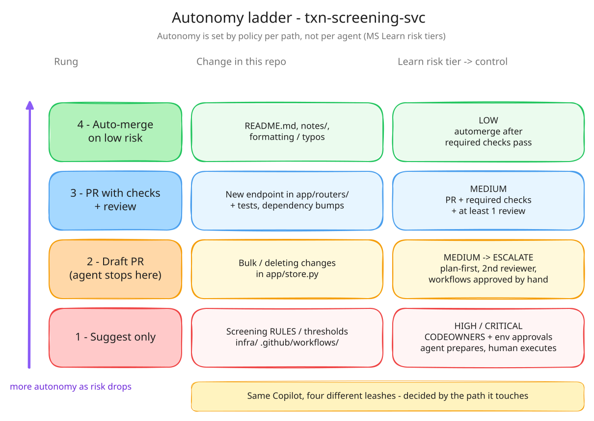
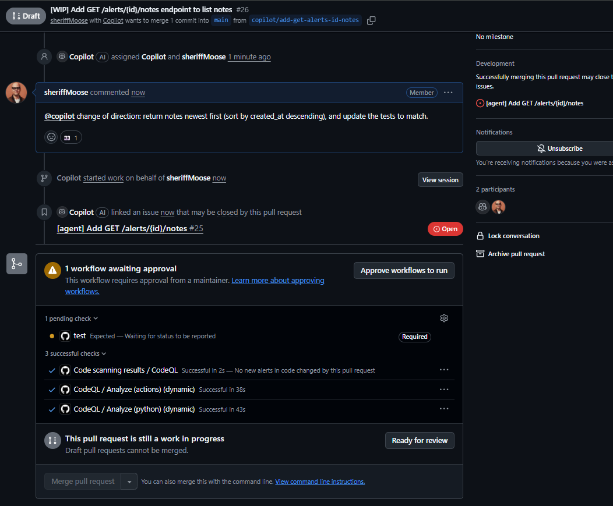

# Day 5 — Poke every fence (and keep the receipts)

> Five questions about Copilot's built-in controls. You probably half-know the answers. Today each one gets **a screenshot or a link**, not a memory.

**Deliverable:** `notes/d05-controls.md`: one line per control (Q1–Q5), each with a screenshot/link · Learn module 1 finished

## Bets

- **Bet A**: Branch prefix Copilot pushes to when it starts from an issue. **My guess: `copilot/`**
  - Result: **Hit**: actual `copilot/` → PR #26 pushed to `copilot/add-get-alerts-id-notes`. Docs: *"a new `copilot/` branch is created for Copilot, and the agent can only push to that branch"* ([Risks and mitigations](https://docs.github.com/en/copilot/concepts/agents/cloud-agent/risks-and-mitigations#copilot-cloud-agent-can-push-code-changes-to-your-repository))
- **Bet B**: I assigned the issue. Can **my** approval satisfy the ruleset's 1 required approval on Copilot's PR? **My guess: No**
  - Result: **Hit**: actual **No**. After my approval the merge box shows *"1 approval"* but also *"Changes reviewed — **No applicable reviews submitted by reviewers with write access**"*. Docs: *"your approval of a Copilot pull request won't count toward the required number"* ([Review Copilot output](https://docs.github.com/en/copilot/how-tos/copilot-on-github/use-copilot-agents/review-copilot-output))

## Mission 1 — Autonomy ladder

Source: [Learn — Autonomy must be designed, not assumed](https://learn.microsoft.com/en-us/training/modules/design-agent-architecture-integration/6-reliable-workflows#autonomy-must-be-designed-not-assumed)

| Rung | `txn-screening-svc` change | Learn risk tier → why |
|---|---|---|
| 1. Suggest only | Screening `RULES` / score thresholds in `app/screening.py`; anything in `infra/` or `.github/workflows/` | **High / Critical**: CODEOWNERS + multiple reviews + stricter rulesets; for deploys and secrets, *agent prepares but can't execute* (environment approvals). Here: read-only planner → plan-first PR → a human writes the change |
| 2. Draft PR | Bulk or data-deleting changes in `app/store.py` | **Medium → High**: `src/`, but checklist §4 says *Escalate*. Copilot's draft PR is where it stops: plan-first, a second reviewer, workflows approved by hand |
| 3. PR with checks (+ review) | New endpoint in `app/routers/` + tests (e.g. `GET /alerts/{id}/notes`) | **Medium** (`src/`): PR required + required checks (`test`) + ≥1 review |
| 4. Auto-merge on low risk | `README.md`, `notes/`, typo/formatting fixes | **Low** (`docs/`, formatting): automerge once required checks pass |

*Source: [`img/d05-autonomy-ladder.excalidraw`](img/d05-autonomy-ladder.excalidraw), open it in excalidraw.com to edit*

- Autonomy is set **by policy per path, not per agent**: the same Copilot gets four different leashes depending on what it touches
- Critical tier control = **environments with required reviewers**: a job targeting `environment: production` **pauses until approval**
- Learn rates dependency bumps **Medium**, not Low, so Dependabot PRs sit on rung 3, not 4

## Mission 2 — Inspectable artifacts, cheap intervention

Sources: [Learn — Traceability and observability](https://learn.microsoft.com/en-us/training/modules/foundations-agentic-ai/5-identify-risks-traceability#traceability-and-observability) · [Docs — Trace commits to session logs](https://docs.github.com/en/copilot/how-tos/copilot-on-github/use-copilot-agents/manage-and-track-agents#trace-commits-to-session-logs) · [Docs — Steer an agent session](https://docs.github.com/en/copilot/how-tos/copilot-on-github/use-copilot-agents/manage-and-track-agents#steer-an-agent-session)

**Where the trail lives** (Learn): PRs + commit history · review comments + approvals · workflow runs + uploaded artifacts · code scanning · secret scanning + push protection events · org audit log

**Minimum audit trail**, checked against Day 4's implementation PR **#21**:

| Learn's minimum | #21 |
|---|---|
| Stated goal | Issue #18 |
| Inspectable plan | `plans/18.md`, merged in #19 |
| Bounded changeset | `copilot/add-filter-alerts-by-transaction-id-again`, 2 files |
| Automated evidence | CI `test` run (after *Approve and run workflows*) |
| Human judgment | My review, plus the checklist verdict on the plan |
| Clear outcome | Merged as 2e485ae |

**Trace + intervene** (GitHub Docs):

- Commits are **authored by Copilot**, with **the person who started the task as co-author**; each commit message **links to the session logs**; commits are **signed → "Verified"**
- **Steer** without stopping: agents page → session → prompt box **below the session log** → Enter. Copilot applies it **after finishing its current tool call**. **Each steering message consumes AI credits**. Not available for third-party agents
- **Stop session** (session log viewer) ends the Actions run and **keeps the commits already pushed**
- Two cheap interventions without blocking delivery: **steer** (redirect) or **stop** (cut losses, keep work)

## Mission 3 — Test task

- Issue: **#25** `[agent] Add GET /alerts/{id}/notes` (Agent task form) · labelled `plan-approved` first, since a rung-3 change doesn't need plan-first and the label keeps the Day 4 gate quiet
- Agent: the **default Copilot agent**. *implementer* would stop with no approved plan in `plans/`, and *planner* can't push
- PR: **#26** (draft, `[WIP]`), opened about a minute after assignment

**What's on the branch** (fetched after session 1 finished; times UTC):

| Commit | Time | Author | Message | From |
|---|---|---|---|---|
| `3b26c37` | 12:21:31 | copilot-swe-agent[bot] | Initial plan | session 1 |
| `7c70263` | 12:23:16 | copilot-swe-agent[bot] | Add alert notes listing endpoint | session 1 |
| `b6d8f61` | 12:24:00 | copilot-swe-agent[bot] | Test unknown alert notes response | session 1, **after the prompt-box steer** |

- Session 1 result: `list(alert.notes)` = **insertion order**, plus tests for empty, ordering, closed and **404 unknown id**; 51 tests pass; **1.1 AI credits** in total (it was 0.8 when I steered, so the steer cost about 0.3) ([screenshot](img/d05-q5-session1-done.png))
- Session 2 (from the PR comment) pushed **after** session 1 finished: `40b0dce` 12:26:20 *Sort alert notes newest first* (parent `b6d8f61`), so the sessions ran **one after the other on the branch, with no conflict**. It changed `list(alert.notes)` → `sorted(..., key=created_at, reverse=True)` and renamed the ordering test to `test_list_alert_notes_returns_newest_first`, then **replied on the PR comment** with the commit SHA
- Final branch: 4 commits; tests: empty list · 404 unknown id · newest first · closed alert
- Commits are authored by `copilot-swe-agent[bot]` with a **`Co-authored-by: sheriffMoose`** trailer ✅ and carry a `gpgsig` signature ✅ (Verified)
- ⚠️ **Docs vs evidence:** the raw commit message has **no session-log link**, only the subject and the co-author trailer. Check whether the GitHub UI shows a link on the commit page before trusting the docs line *"each commit message links to the session logs"*

## Controls (Q1–Q5)

| # | Control | Answer | Evidence | Evidence or memory? |
|---|---|---|---|---|
| Q1 | Branch prefix | `copilot/` (PR #26 → `copilot/add-get-alerts-id-notes`); pushes to **one branch only**; on an existing PR it pushes to that PR's branch | [screenshot](img/d05-pr26-branch-mergebox-steer.png) · [Docs](https://docs.github.com/en/copilot/concepts/agents/cloud-agent/risks-and-mitigations#copilot-cloud-agent-can-push-code-changes-to-your-repository) | ✅ evidence |
| Q2 | Workflow runs on Copilot's PR | **Not automatically**: the merge box shows *"1 workflow awaiting approval"* + **Approve workflows to run**; the required `test` check is stuck at *Waiting for status*. **But CodeQL ran by itself** (3 green checks): that's Copilot's built-in security validation, not my workflows. After **Approve workflows to run**, `test` passed → *All checks have passed (4)* | [before](img/d05-pr26-branch-mergebox-steer.png) · [after](img/d05-q2-q4-mergebox-after-workflows.png) · [Docs](https://docs.github.com/en/copilot/how-tos/copilot-on-github/use-copilot-agents/review-copilot-output#manage-github-actions-workflow-runs) | ✅ evidence |
| Q3 | Assigner's approval | **Doesn't count.** The merge box shows *1 approval*, yet *"No applicable reviews submitted by reviewers with write access"*: I'm the assigner (and co-author), so my approval is ignored. ⚠️ **Caveat:** the ruleset had **Required approvals = 0** ([screenshot](img/d05-q3-ruleset-required-approvals-0.png)), so #26 was mergeable anyway ([merge box](img/d05-q2-q4-mergebox-after-workflows.png)): the control was **never enforced**. **Re-tested with Required approvals = 1:** *Review required* + **Merging is blocked**: *"At least 1 approving review is required by reviewers with write access. **Approvals from users that collaborated with the coding agent on changes will not satisfy review requirements.**"* My approval still shows (*1 approval*) but doesn't count. The rule covers anyone who **collaborated** with the agent, not just the assigner | [blocked with 1 required](img/d05-q3-merge-blocked-approvals-1.png) · [screenshot](img/d05-q3-self-approval-mergebox.png) · [Docs](https://docs.github.com/en/copilot/how-tos/copilot-on-github/use-copilot-agents/review-copilot-output) · [Risks](https://docs.github.com/en/copilot/concepts/agents/cloud-agent/risks-and-mitigations) | ✅ evidence |
| Q4 | Ruleset / bypass actor | **My `main` ruleset doesn't block Copilot.** Ruleset `main` (Active) targets only the **default branch**, with *Restrict deletions* + *Require a pull request* + *Require status checks*; the bypass list is empty. Copilot only ever pushes to `copilot/*`, which no rule targets, and it opens a PR, which is exactly what the rules require. **Bypass experiment:** added Copilot as a bypass actor → **nothing changed** on #26: still *Review required / Merging is blocked*. A bypass exempts **the actor** (Copilot's own pushes and PRs); it never lets *me* merge, and Copilot doesn't merge. You only need it when a rule stops Copilot from **creating or updating its branch** (e.g. *Restrict creations/updates* or author-restricted rules matching `copilot/**`). **Removed again** ✅ (bypass list empty) | [bypass list before](img/d05-q4-ruleset-before-bypass.png) · [rules](img/d05-q4-ruleset-rules.png) · [Docs](https://docs.github.com/en/copilot/concepts/agents/cloud-agent/about-cloud-agent#limitations-in-copilot-cloud-agents-compatibility-with-other-features) | ✅ evidence (before); after = observed, no screenshot |
| Q5 | Steering mid-task | **`@copilot` PR comment → a NEW session**, not a steer: 👀 reaction, then *"Copilot started work on behalf of sheriffMoose"*; the agents page shows **two active sessions on #26** ("New task", started now · "Implementing GET /alerts/{id}/notes…", 1 min earlier). **Session prompt box → a real steer, same session**: the message shows up inline in the log and the agent continues *Progress update: Plan unknown alert notes test → Edit `tests/test_alerts.py` → Run full test suite → secret scanning → review*, all in the same log with no new session. The box placeholder reads *"Steer active session while agent is working"*, with **Stop** next to Send. Session counter: GPT-6 Luna · 0.8 AI credits | [PR timeline](img/d05-pr26-branch-mergebox-steer.png) · [agents page](img/d05-q5-pr-comment-new-session.png) · [prompt-box steer](img/d05-q5-prompt-box-steer.png) | ✅ evidence |

## Mission 8 — Learn module 1

Sources: [Learn — GitHub as the control plane](https://learn.microsoft.com/en-us/training/modules/foundations-agentic-ai/4-describe-github-system-record-control-plane#github-as-the-control-plane) · [Learn — The contributor model](https://learn.microsoft.com/en-us/training/modules/foundations-agentic-ai/6-apply-contributor-model-agent-generated-work#the-contributor-model)

**System of record vs control plane**

- **System of record** = where work is *stored and inspectable*: repos/branches, commits/PRs, issues (intent), workflow runs + artifacts (evidence), review history (decisions)
- **Control plane** = where work is *enforced*. Six controls:

| Control | Enforces | Today's evidence |
|---|---|---|
| Pull requests | Changes proposed before merge | Copilot can only deliver via PR #26 on `copilot/*` |
| Required reviews | Human approval gate | Q3: blocked at 1, my collaborator approval ignored |
| Required status checks | CI evidence before merge | `test` (Required) waited for *Approve workflows to run* |
| CODEOWNERS | Review routing by path | Not exercised (#26 touched no owned path) |
| Rulesets / branch protection | Central branch policy | Q4: `main` ruleset; bypass list = actors exempted |
| Environments | Approvals for deploys/secrets | Not used yet (rung 1 / Critical tier) |

- > *"The supervision model works everywhere; **enforcement requires the controls to be turned on**."* That's exactly today's Required approvals = 0 finding: the control existed in name only
- *"What the agent can do"* often reduces to **what the workflow token and tool credentials can do** → least-privilege `GITHUB_TOKEN`, permissions per job
- Built-in guardrail named in Learn: **Approve and run workflows** for agent PRs (= Q2)

**Contributor model**: judge agent PRs by the workflow's standards, not by the novelty of the author. Avoid **excessive suspicion** ("AI wrote it") *and* **excessive trust** ("automation produced it")

Rubric applied to **#26**:

| Rubric | #26 |
|---|---|
| Intent | ✅ Issue #25 contract; plan in the PR (rung 3, no plan-first) |
| Scope | ✅ `app/routers/alerts.py` + `tests/test_alerts.py` only |
| Evidence | ✅ `test` + CodeQL green after workflow approval; 4 commits, session logs |
| Ownership | ➖ no CODEOWNERS path touched |
| Policy | ⚠️ ruleset satisfied only because approvals = 0 |
| Fallback | ✅ one revertable merge; no data or infra change |

Good = **understandable · bounded · reviewable · policy-compliant · reconstructable**

## Solo-repo decision: how #26 merged

- Chose to **set Required approvals back to 0** and merge #26 myself
- Trade-off vs a break-glass bypass: a bypass is **per merge** and shows up in the audit trail as a bypass; dropping the count to 0 **turns the control off for every PR** until I raise it again, and the merge looks like a normal one
- Why it's acceptable *here*: a solo learning repo with synthetic data, where one human can't be an independent reviewer of anything. Why it wouldn't be at the bank: it removes the *human judgment* step from Learn's minimum audit trail for **all** changes, not just this one
- Real fix for a team repo: keep 1 (or more) and add a second reviewer, with CODEOWNERS on `app/screening.py`, `infra/`, `.github/`

## Parking lot

- Ruleset finding: **Required approvals was 0** on `main`, so every PR I "needed a review" on since Day 1 (including Copilot's #21) could have merged with none. Day 4's note *"my approval wouldn't count toward required approvals"* was true and irrelevant. Raised to 1 to prove Q3, then **back to 0** so a solo repo can merge (see *Solo-repo decision*)
- New ruleset option (Preview): **Require an additional approval for unattributed Copilot pull requests**, *"When Copilot opens a pull request without a human collaborator, require one more approving review if a non-zero approval count is required."* It's ticked (Docs: **enabled by default** for new and existing rulesets — [Available rules](https://docs.github.com/en/repositories/configuring-branches-and-merges-in-your-repository/managing-rulesets/available-rules-for-rulesets#require-a-pull-request-before-merging)), but with 0 required it does nothing. *Unattributed* = Copilot opened the PR under its own app identity, e.g. prompted from a shared channel or thread. #26 is *attributed* ("sheriffMoose with Copilot"), so it wouldn't apply there anyway. Matches the Risks doc line *"one more approval is required"* when Copilot opens a PR under its own identity
- Related option worth knowing: **Require approval of the most recent reviewable push** (approval by someone other than the last pusher)

## Done when

- [x] `notes/d05-controls.md` has one line per control (Q1–Q5), each with a screenshot/link
- [x] **Every answer is backed by evidence, not memory** (Q4 *after* state observed without a screenshot)
- [x] Copilot is no longer a bypass actor on the `main` ruleset
- [x] Learn module 1 (Foundations of Agentic AI in GitHub) finished

## Reflection

- Which control surprised me, compared with my bet?
- Financial-crime angle: which rung of the autonomy ladder would a change to a sanctions-screening threshold sit on, and which of today's controls would enforce it?
