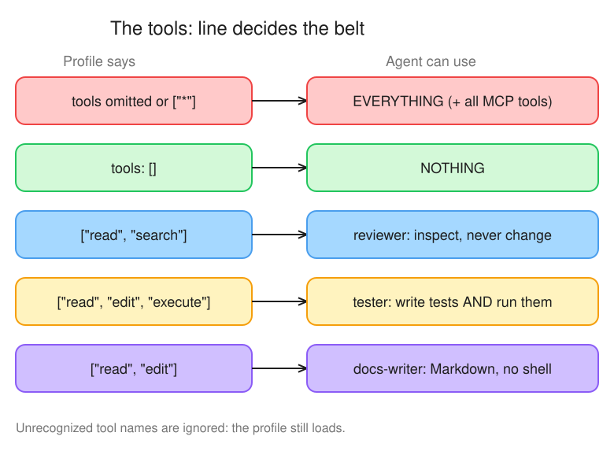
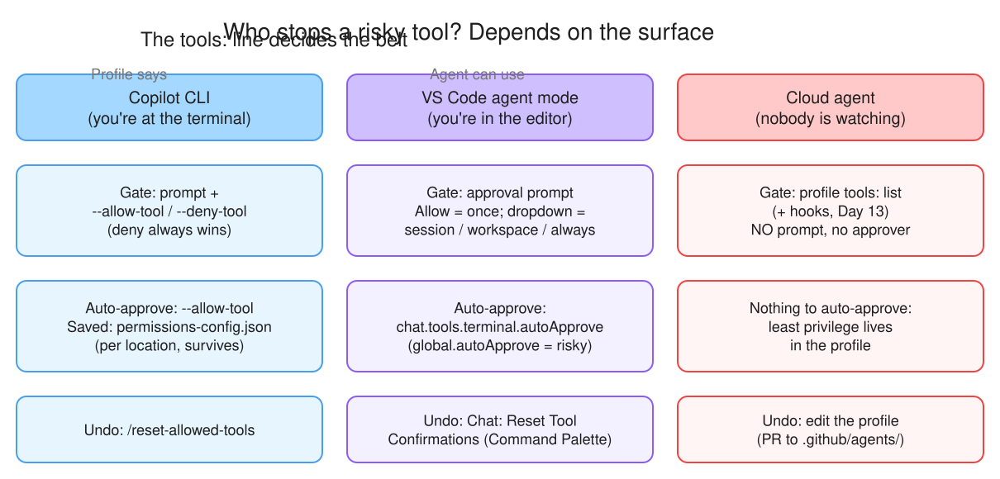

# Day 8 — Least-privilege tool belts

> Three agents, three tool belts. What does an agent do when the job needs a tool you **didn't** give it, and what stops Copilot CLI from running `git push` when you said *allow everything*?

**Deliverable:** `notes/d08-tools.md`: table of agent · tools · why · what happened when a missing tool was needed

## Bets

- **Bet A** — The **reviewer** agent (tools: `read`, `search`) is assigned a task that needs a file edit. What does it do? **My guess: Silently does nothing**
  - Result: **Hit (mostly)**: actual: no edit, an **empty** PR [#49](https://github.com/mosherif-labs/github-labs/pull/49) (*"No files were changed"*), and the missing docstring reported as a **should-fix** finding. It stayed in its reviewer role and never said it lacked an edit tool ([session screenshot](img/d08-reviewer-49-session.jpg))
- **Bet B** — Copilot CLI started with `--allow-all-tools --deny-tool='shell(git push)'`. Can the agent run `git push`? **My guess: No, deny wins**
  - Result: **Hit**: actual **No, deny wins**. Docs: *"Deny rules always take precedence over allow rules, even when `--allow-all` is set or a matching approval has been saved in `permissions-config.json`."* ([Allowing and denying tool use](https://docs.github.com/en/copilot/how-tos/copilot-cli/use-copilot-cli/allowing-tools#allowing-or-denying-permission-for-specific-tools))

## Lessons (Mission 1 — Anatomy of an agent profile)

Sources: [Custom agents configuration](https://docs.github.com/en/copilot/reference/custom-agents-configuration) — [properties](https://docs.github.com/en/copilot/reference/custom-agents-configuration#yaml-frontmatter-properties) · [tools](https://docs.github.com/en/copilot/reference/custom-agents-configuration#tools) · [aliases](https://docs.github.com/en/copilot/reference/custom-agents-configuration#tool-aliases)

*Editable source: [d08-tool-belts.excalidraw](img/d08-tool-belts.excalidraw)*

- `description` is the only **required** property; `tools` omitted = **all tools** (MCP included), `tools: []` = **none**. Least privilege = always write the list
- Aliases: `read`, `search`, `edit`, `execute` (shell/Bash/powershell), `agent`; `web` and `todo` are not applicable for the cloud agent
- Unrecognized tool names are ignored: the profile still loads. Typo case: `["read", "serach"]` = only `read`. The `tools` list **filters** built-in and MCP tools alike, and a typo fails silently (a misspelled `execute` quietly leaves the agent unable to run tests)
- `execute` is a back door: a shell can write files (`echo > f`, `sed -i`), so a profile without `edit` but with `execute` is **not** read-only. "Never changes files" means no `edit` **and** no `execute`
- Tool-belt pick (before reveal): reviewer `read, search` ✔ · tester `execute` only ✘ (needs `read` + `edit` too) · docs-writer `read, search, edit` (plan: `read, edit`)

## Lessons (Mission 2 — Allow, deny, approve)

Source: [Allowing or denying permission for specific tools](https://docs.github.com/en/copilot/how-tos/copilot-cli/use-copilot-cli/allowing-tools#allowing-or-denying-permission-for-specific-tools)

- `--allow-tool` = run without prompting; `--deny-tool` = never usable. **Deny beats allow**, even `--allow-all` and saved approvals
- Patterns: `shell` (all shell) · `shell(git commit)` (one command) · `shell(git:*)` (git + any subcommand) · `write` · `write(path)` · `MyMCP(create_issue)`
- `--allow-tool='shell(git:*)' --deny-tool='shell(git push)'` = all git except push (Mission 5's setup)
- **Two layers** ([source](https://docs.github.com/en/copilot/how-tos/copilot-cli/use-copilot-cli/allowing-tools#restricting-the-choice-of-tools-available-to-the-ai-model)): `--available-tools` / `--excluded-tools` = which tools the model can **even choose**; `--allow-tool` / `--deny-tool` = **permission** to run them. Not in the available set = unusable, even with `--allow-tool`
- Both `--available-tools` and `--excluded-tools` given: **`--available-tools` (allowlist) wins**, the denylist is ignored. ⚠️ Opposite of allow/deny, where deny wins (I picked `--excluded-tools`: see gap-log)
- **Persisted** ([source](https://docs.github.com/en/copilot/how-tos/copilot-cli/use-copilot-cli/allowing-tools#persisted-permissions)): interactive approvals for a location are saved to `permissions-config.json` in the config dir; permanent URL approvals go to `allowedUrls` in `settings.json` (all sessions). Command-line flags apply **only to the current session**. `/reset-allowed-tools` clears saved approvals. Deny still beats saved approvals
- **VS Code** ([Tool approval](https://code.visualstudio.com/docs/copilot/chat/chat-tools#tool-approval)): **Allow** = once; the Allow dropdown = session / workspace / all future invocations. `chat.tools.terminal.autoApprove` auto-approves listed terminal commands; `chat.tools.global.autoApprove` approves everything (risky). Undo: **Chat: Reset Tool Confirmations** (Command Palette)
- **Cloud agent never asks**: it runs non-interactively, so the profile's `tools:` list (and hooks) is the only gate

*Editable source: [d08-three-surfaces.excalidraw](img/d08-three-surfaces.excalidraw)*

## Lessons (Mission 3 — Forge three tool belts)

Source: [Creating a custom agent profile](https://docs.github.com/en/copilot/how-tos/copilot-on-github/customize-copilot/customize-cloud-agent/create-custom-agents#creating-a-custom-agent-profile-in-a-repository-on-github)

- Profiles: repo = `.github/agents/NAME.agent.md`; **org-wide** = the org's `.github` or `.github-private` repo; **enterprise** = `.github-private` of a designated org. (Live docs, 2026-10-05: the plan only listed `.github-private` for orgs)
- Filename (before `.agent.md`) may only use `.` `-` `_` `a-z` `A-Z` `0-9`: `docs_writer.v2.agent.md` is fine, `docs writer.agent.md` (space) is not
- `reviewer`, `tester`, `docs-writer` committed on `d08/tool-belts` (`cbcf1c0`) and merged to `main`

## Tool table

| agent | tools | why | what happened when a missing tool was needed |
|---|---|---|---|
| reviewer | `read`, `search` | Inspects, never changes. No `edit` **and** no `execute`: a shell could still write files | #46 needed `edit`: **refused silently**: empty PR [#49](https://github.com/mosherif-labs/github-labs/pull/49), reported it as a should-fix finding ([log](img/d08-reviewer-49-session.jpg)) |
| tester | `read`, `edit`, `execute` | Must write test files **and** run pytest; without `execute` it can't prove they pass | #48 needed `web`: **worked around it**: *"the release-notes site could not be fetched"*, verified against FastAPI's GitHub 0.115.0 release entry instead, PR [#51](https://github.com/mosherif-labs/github-labs/pull/51) ([log](img/d08-tester-51-session.jpg)) |
| docs-writer | `read`, `edit` | Only edits Markdown; a shell would let it change code and run anything | #47 needed `execute`: ⚠️ **ran it anyway via a sub-task**: *Task: Run full pytest suite* ran `uv run pytest -v` (66 passed), PR [#50](https://github.com/mosherif-labs/github-labs/pull/50) ([log](img/d08-docs-writer-50-session.jpg)) |

## Mission 4 — missing-tool issues

| agent | issue | needs | PR |
|---|---|---|---|
| reviewer | [#46](https://github.com/mosherif-labs/github-labs/issues/46) docstring on `list_alerts` | `edit` | [#49](https://github.com/mosherif-labs/github-labs/pull/49) (WIP) |
| docs-writer | [#47](https://github.com/mosherif-labs/github-labs/issues/47) test pass count in README | `execute` | [#50](https://github.com/mosherif-labs/github-labs/pull/50) |
| tester | [#48](https://github.com/mosherif-labs/github-labs/issues/48) FastAPI release-notes note | `web` (not on cloud agent) | [#51](https://github.com/mosherif-labs/github-labs/pull/51) (WIP) |

Side note: the Day 4 plan-gate workflow commented *"plan not approved"* on each issue, and Copilot still started work and opened a WIP PR.

**Biggest surprise:** docs-writer's `tools: ["read", "edit"]` did not stop the tests running. The session delegated to *Task* sub-steps, and the sub-task ran shell commands (install deps, `uv run pytest -v`). Open question: is that the `agent`/`Task` alias (not in its list), or a built-in helper outside the `tools:` filter? The sessions also started the `runtime-tools`, `github-mcp-server` and `playwright` MCP servers. Lesson: verify the session log, don't trust the profile alone; the next layer is hooks (Day 13).

## Copilot CLI run

| run | flags | allowed | refused |
|---|---|---|---|
| 1 | `--allow-tool='shell(git:*)' --deny-tool='shell(git push)'` | branch `d08-cli` + commit | `git push` (deny beats allow) |
| 2 | `--deny-tool=write` | ⚠️ the **shell**: it appended to README.md with a shell command instead | the `write` tool only |

- ⚠️ **Unverified (self-reported):** no session output or logs captured; re-run with `copilot -p ... *> m5-runN.log` and record the exact messages
- Run 2 = Mission 1's back door, live: denying `write` doesn't stop file changes while `shell` is allowed. To really block writes: `--deny-tool=write --deny-tool=shell` (or `--available-tools` without shell)

## Where each surface enforces tool limits

Cloud agent: profile `tools:` · VS Code: approval prompts · CLI: `--allow-tool` / `--deny-tool`. On all three: verify the session log; hooks are the next layer (Day 13).

## Reflection

- **Hardest to scope:** tester. It needs `edit` + `execute`, the riskiest pair, and nothing in the profile limits it to `tests/` only
- **Biggest surprise:** docs-writer ran pytest without `execute` (via a *Task* sub-step). Takeaway: `tools:` is necessary, but verify the session log and add hooks / required checks / review
- **Financial Crimes:** never give `execute` (shell) or MCP write tools to an agent that touches alert-disposition code; the model-risk / control owner signs off on that list via CODEOWNERS
