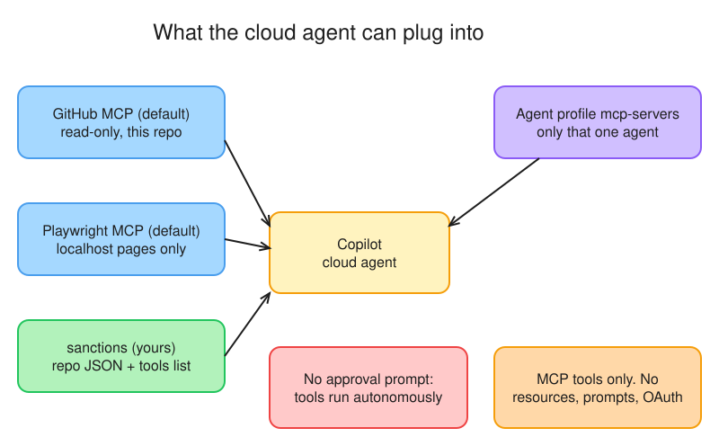
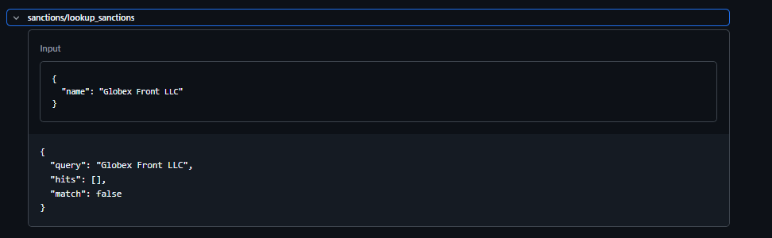
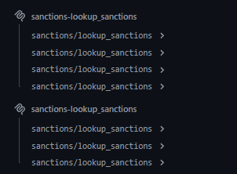

# Day 9 — Plug in MCP (and keep the lid on)

> Your cloud agent needs a sanctions lookup it doesn't have. Build the tool as an MCP server, hand it a secret the right way, and prove from the session log that the agent called it.

**Deliverable:** `notes/d09-mcp.md`: session-log link, screenshot of the tool call, and the *where does MCP config live* answer

## Bets

- **Bet A** — The cloud agent is about to call a tool from an MCP server you configured. Does it ask anyone for approval first? **My guess: No, never**
  - Result: **Hit**: actual **No, never**. Docs: *"Copilot will use available tools autonomously, and will not ask for approval before use."* ([MCP and Copilot cloud agent](https://docs.github.com/en/copilot/concepts/agents/cloud-agent/mcp-and-cloud-agent#setting-up-mcp-servers-in-a-repository))
- **Bet B** — Where must the API key for a cloud-agent MCP server be stored? **My guess: Actions secret**
  - Result: **Miss**: actual **Agents secret named `COPILOT_MCP_*`**. I said *Actions secret*; Agents secrets are a separate type. Docs: *"Variables and secrets that you configure are exposed to Copilot as environment variables, except secrets and variables prefixed with `COPILOT_MCP_`, which are only available to MCP servers."* ([Configure secrets and variables](https://docs.github.com/en/copilot/how-tos/copilot-on-github/customize-copilot/customize-cloud-agent/configure-secrets-and-variables#naming-requirements-for-secrets-and-variables))

## Lessons (Mission 1 — What the cloud agent gets out of the box)

Source: [MCP and Copilot cloud agent](https://docs.github.com/en/copilot/concepts/agents/cloud-agent/mcp-and-cloud-agent)

*Editable source: [d09-cloud-agent-mcp-belt.excalidraw](img/d09-cloud-agent-mcp-belt.excalidraw)*

- Cloud agent (and code review) support **MCP tools only**, not resources or prompts, and **no remote servers that use OAuth**
- Two default servers: **GitHub MCP** (specially scoped token, read-only, current repo only, customizable) and **Playwright MCP** (only `localhost` / `127.0.0.1` inside Copilot's environment)
- Repo admins set a JSON config in repo settings; it applies to the cloud agent **and** code review
- **No approval step**: tools run autonomously, so the allowlist is your only guardrail
- MCP servers in an agent profile are available **only to that agent**

## Lessons (Mission 2 — Repo-level config and its secrets)

Source: [Configure secrets and variables for Copilot cloud agent](https://docs.github.com/en/copilot/how-tos/copilot-on-github/customize-copilot/customize-cloud-agent/configure-secrets-and-variables)

- **Agents** secrets/variables are their own type (org or repo level), separate from Actions, Codespaces and Dependabot
- Only names prefixed `COPILOT_MCP_` reach your MCP config, and they are **reserved for MCP servers** (not exposed as normal env vars to the agent)
- Names: alphanumeric + underscore, can't start with `GITHUB_` or a number; if a name exists at two levels, the **repo-level value wins**
- Repo config JSON ([Extending the cloud agent with MCP](https://docs.github.com/en/copilot/how-tos/copilot-on-github/customize-copilot/customize-cloud-agent/extend-cloud-agent-with-mcp)): top-level `mcpServers`; each server needs `tools` (allowlist, or `*`) and `type` (`local`, `stdio`, `http`, `sse`). Local = `command` + `args` (+ optional `env`); remote = `url` (+ optional `headers`)
- Where: repo **Settings → Copilot → MCP servers** → **Save MCP configuration** (validates syntax); then add the `COPILOT_MCP_*` Agents secret. In `env`, reference it as `$COPILOT_MCP_...`
- From VS Code's `.vscode/mcp.json`: add `tools` per server, replace `inputs` / `envFile` with `env`
- The old `copilot` **environment** was migrated automatically to Agents secrets: on the exam the answer is *Agents secrets*

## Lessons (Mission 3 — Shrink the GitHub MCP server)

Sources: [Extending the cloud agent with MCP](https://docs.github.com/en/copilot/how-tos/copilot-on-github/customize-copilot/customize-cloud-agent/extend-cloud-agent-with-mcp#customizing-the-built-in-github-mcp-server) · [Configuring toolsets](https://docs.github.com/en/copilot/how-tos/copilot-in-your-ide/customize-copilot/extend-copilot-with-tools-and-context/configure-toolsets) · [remote-server.md](https://github.com/github/github-mcp-server/blob/main/docs/remote-server.md) · [Custom agents configuration](https://docs.github.com/en/copilot/reference/custom-agents-configuration)

- Built-in GitHub MCP token is read-only and scoped to the current repo; widen it with a PAT (`COPILOT_MCP_GITHUB_PERSONAL_ACCESS_TOKEN`) or a GitHub App (`COPILOT_MCP_GITHUB_APP_ID`, `..._INSTALLATION_ID`, `..._PRIVATE_KEY`). The docs' example URL is `https://api.githubcopilot.com/mcp/readonly` + `X-MCP-Toolsets`; *"Remove \"/readonly\" to enable wider access to all tools."*
- Default toolsets (Copilot docs): `repos`, `issues`, `pull_requests`; extras like `actions`, `code_security`, `secret_protection`; keywords `all` and `default`. ⚠️ The server README lists `context, repos, issues, pull_requests, users` as its default: use the Copilot docs wording for the exam
- Remote server: **URL path** (`/x/{toolset}`) for one toolset, **`X-MCP-Toolsets` header** (comma-separated) for several. Read-only = `/readonly` suffix **or** `X-MCP-Readonly` header
- Agent profile secrets: env-var forms (`$VAR`, `${VAR}`, `${VAR:-default}`) work in repo JSON and profiles; `${{ secrets.X }}` / `${{ vars.X }}` only in the profile YAML. Must be Agents secrets/variables (org or repo)
- Processing order: out-of-the-box (GitHub MCP) → custom agent `mcp-servers` → repository settings. `stdio` (VS Code / Claude Code) maps to the cloud agent's `local` type

## Lessons (Mission 4 — VS Code: read-only GitHub MCP)

Config: [`.vscode/mcp.json`](../.vscode/mcp.json) (`servers` key; `http` type; `X-MCP-Toolsets: repos,issues` + `X-MCP-Readonly: true`)

- Server started and signed in from VS Code. **Configure Tools** listed only the read tools for `repos` / `issues`
- Write test (*Create an issue titled "d09 read-only test"*): no create tool exists, so nothing was created. The agent only searched for an existing issue with that title (a read tool), found none, and skipped creation
- VS Code's file uses `servers`; the cloud agent's repo JSON uses `mcpServers` (and needs `tools` + `type` on every server)

## Lessons (Mission 5 — Build `lookup_sanctions`)

Files: [`app/tools/sanctions_mcp.py`](../app/tools/sanctions_mcp.py) · [`app/tools/data/sanctions_synthetic.json`](../app/tools/data/sanctions_synthetic.json) (synthetic only)

- `mcp[cli]` 2.3.0 installed with `uv add` (it is now in `pyproject.toml`); 2.x uses `from mcp.server import MCPServer`, 1.x used `FastMCP`. `@mcp.tool()` returns the plain function, and the docstring becomes the tool description
- `mcp dev` needs Node: npm failed with EPERM on the shared cache `C:\ProgramData\npm\npm-cache`; fix = point `npm_config_cache` at a folder I own (this PowerShell window only)
- First call returned `{"error": "SANCTIONS_API_KEY not set"}`: a **stdio server only sees the default environment plus the `env` you pass explicitly** (SDK: `get_default_environment() | server.env`), so my shell variable never reached it. Same reason the cloud agent's MCP JSON needs an `env` block mapping to `$COPILOT_MCP_...`
- Inspector 2.9.0 has no Environment Variables sidebar; set it at launch: `npx @modelcontextprotocol/inspector -e SANCTIONS_API_KEY=synthetic-key uv run mcp run app/tools/sanctions_mcp.py` (or an `env` key in a `--config` catalog file)
- Result: `lookup_sanctions("placeholder")` returns one hit (Ivan Placeholderov, `SYN-SDN`), `match: true`

## Lessons (Mission 6 — Wire it into the cloud agent)

Files: [`copilot-setup-steps.yml`](../.github/workflows/copilot-setup-steps.yml) · [`tester.agent.md`](../.github/agents/tester.agent.md) · PR [#53](https://github.com/mosherif-labs/github-labs/pull/53)

- Repo **Settings → Copilot → MCP servers**: `mcpServers.sanctions` (`type: local`, `command: uv`, `args: [run, mcp, run, app/tools/sanctions_mcp.py]`, `tools: [lookup_sanctions]`, `env.SANCTIONS_API_KEY: $COPILOT_MCP_SANCTIONS_API_KEY`). Secret = repo **Agents** secret `COPILOT_MCP_SANCTIONS_API_KEY`, never in the JSON
- Adapted the guide's setup steps to this repo: it has no `requirements.txt`, it uses `uv`, so `setup-uv` + `uv sync --locked` (same as CI) installs the app, pytest **and** `mcp[cli]` (added to `pyproject.toml` / `uv.lock`)
- `copilot-setup-steps.yml` must be on the default branch, and its job must be named `copilot-setup-steps`; the run on `main` was green
- Profile `tester`: `mcp-servers:` in the frontmatter (profile-only, secret via `${{ secrets.COPILOT_MCP_... }}`) and `sanctions/lookup_sanctions` in `tools:` (`server/tool` naming; `server/*` = all tools of a server). The `tools:` list filters MCP tools too

## Where MCP config lives

Closed-book answers (Mission 8), checked against [Custom agents configuration](https://docs.github.com/en/copilot/reference/custom-agents-configuration#mcp-server-configurations):

- **VS Code:** `.vscode/mcp.json` (workspace) or user `settings.json`; top-level key `servers` ✔
- **Cloud agent:** repo **Settings → Copilot → MCP servers** (JSON, `mcpServers`, each server with `tools` + `type`); secrets as **Agents** secrets `COPILOT_MCP_*` ✔
- **Agent profile:** `mcp-servers:` in the `.agent.md` frontmatter, available only to that agent, and **not used** by VS Code/IDE custom agents ✔
- **Same server name at several levels:** ✘ I said the agent profile. Order is out-of-the-box (GitHub MCP) → custom agent → **repository settings last**; docs: *"This allows each level to override settings from the previous level as appropriate."* So **repository settings win**

## Session log

**Deliverable:** [Copilot cloud agent session](https://github.com/mosherif-labs/github-labs/tasks/82c8ef12-e054-4265-8547-fc5eb3ec3b0a?author=sheriffMoose) (issue assigned to Copilot with the `tester` agent)

- The log shows the tool as `sanctions/lookup_sanctions` (`server/tool` naming), listed seven times in two groups
- Example call: input `{"name": "Globex Front LLC"}` → `{"query": "Globex Front LLC", "hits": [], "match": false}`: the agent used the tool for a **clean** case, so the secret reached the server (no `SANCTIONS_API_KEY not set` error) and nobody approved the call

## Reflection

- **Surprised me most:** no OAuth for remote MCP servers on the cloud agent (also: tools only, and no approval prompts)
- **If it had write tools:** allowlist **nothing** until a human has reviewed each write tool, because the agent calls allowlisted tools autonomously
- **Financial Crimes angle:** I'd have a security-team ticket approve a watchlist server's allowlist. ⚠️ Gap: that record lives outside the repo, and the repo-level MCP JSON lives in repo **Settings**, not in git, so CODEOWNERS can't guard it. The agent **profile** (`.github/agents/*.agent.md`, with its `tools:` and `mcp-servers:`) *is* a file, so CODEOWNERS can. Link the ticket from the profile's PR

