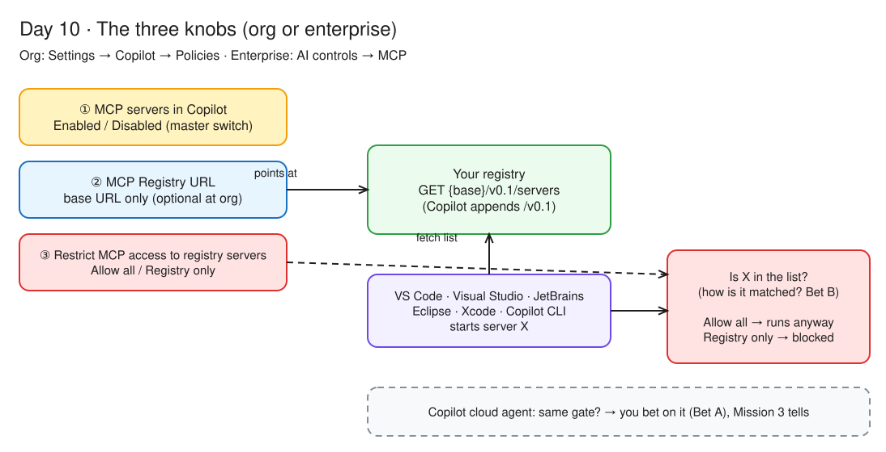
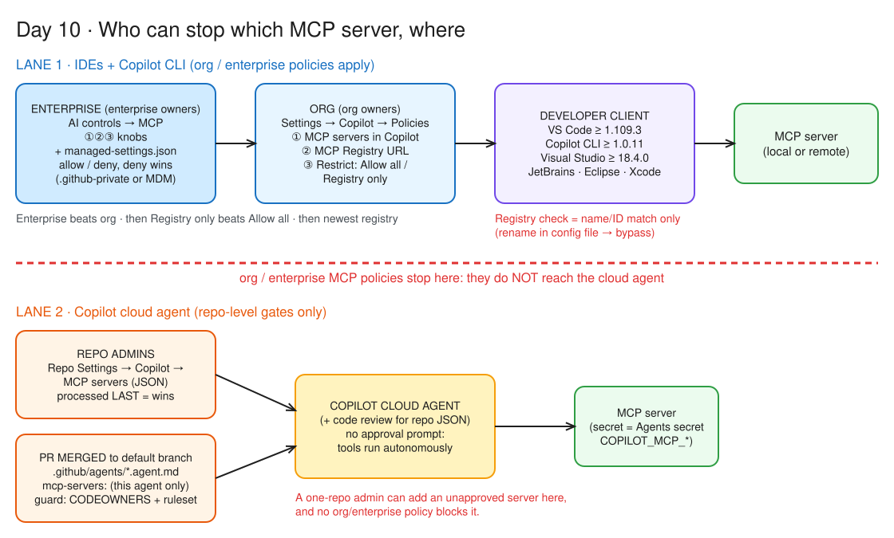

# Day 10 — Who guards the MCP gate?

> *"A developer can't add MCP server X. Which setting, at what level?"* By tonight that's a one-sentence answer, you've published a registry you can `curl`, and you know the surfaces where the gate **doesn't** close.

**Deliverable:** `notes/d10-mcp-governance.md`: registry conformance checklist, click path and one-sentence answers, a live static registry you curled (+ settings map if time, else Day 14; + screenshots from the Business-seat side quest)

## Bets

- **Bet A** — Your org switches to **Registry only**. Is that allowlist enforced for the **Copilot cloud agent**? **My guess: Yes**
  - Result: **Miss**: actual **No**. The *Supported surfaces* table gives enforcement versions for CLI, VS Code, Visual Studio, JetBrains, Eclipse and Xcode, but **none for the Copilot cloud agent**. Its MCP gate is repo settings + agent profiles instead ([Supported surfaces](https://docs.github.com/en/copilot/reference/enterprise-administrators/mcp-private-registry-enforcement#supported-surfaces))
- **Bet B** — How does enforcement decide a server is on the registry? **My guess: Server name/ID match**
  - Result: **Hit**: actual **name/ID match**. Docs: *"Enforcement is based only on server name/ID matching, which can be bypassed by editing configuration files."* ([Current enforcement limitations](https://docs.github.com/en/copilot/reference/enterprise-administrators/mcp-private-registry-enforcement#current-enforcement-limitations))

## Lessons (Mission 2 — The three knobs)

Source: [Configure MCP server access](https://docs.github.com/en/copilot/how-tos/administer-copilot/manage-mcp-usage/configure-mcp-server-access#configuring-the-mcp-allowlist-policy-for-an-organization) · [Configure an MCP registry](https://docs.github.com/en/copilot/how-tos/administer-copilot/manage-mcp-usage/configure-mcp-registry#endpoint-and-specification-requirements)

*Editable source: [d10-three-knobs.excalidraw](img/d10-three-knobs.excalidraw)*

- Registry URL + access policy decide which MCP servers developers can **discover and use in supported IDEs and Copilot CLI**; you need a registry first. Status: **public preview**
- **Org:** Settings → Copilot → **Policies** → *MCP servers in Copilot* = **Enabled** · *MCP Registry URL* (**optional** at org) · *Restrict MCP access to registry servers* = **Allow all** / **Registry only** (applies immediately)
- **Enterprise:** **AI controls → MCP** → *MCP servers in Copilot* = **Enabled everywhere** · same URL + restrict settings
- Enter the **base URL only**: Copilot appends the v0.1 path (adding `/v0.1/servers` breaks it, per the Azure API Center note)
- Registry must serve the **v0.1** spec: `GET /v0.1/servers`, `/v0.1/servers/{serverName}/versions/latest`, `/v0.1/servers/{serverName}/versions/{version}`
- CORS on every `/v0.1/servers` route: `Access-Control-Allow-Origin: *` · `Access-Control-Allow-Methods: GET, OPTIONS` · `Access-Control-Allow-Headers: Authorization, Content-Type`
- Hosting: fork of the open-source MCP Registry, Docker, your own, or **Azure API Center** (CORS handled for you, but you must allow **anonymous access** in its visibility settings). Build to **v0.1**; v0 is unstable
- Second control (enterprise owners, Business/Enterprise): [`managed-settings.json` allowlist](https://docs.github.com/en/copilot/how-tos/administer-copilot/manage-mcp-usage/configure-enterprise-allowlist), usually in the `.github-private` repo (or pushed by MDM). `allowedMcpServers` / `deniedMcpServers`, matched by `serverUrl` (trailing `*` wildcard) or `serverCommand` (array). Order: built-in defaults always allowed → **deny wins** → not on an existing allowlist = blocked → unresolved variable = blocked. Every layer must allow it
- **Guest-list rule:** once `allowedMcpServers` exists, a server must **match it** *and* **not match** `deniedMcpServers`; not being denied is not enough. `serverCommand` matches **exactly** (`@1.2.0` ≠ `@latest`)
- Don't run both controls: the docs say set the registry policy to **Allow all** (optionally clear the URL) so `managed-settings.json` is the single source of truth
- Failure modes: malformed JSON = **empty allowlist** (only built-in defaults run); unreachable layer = client **keeps the last enforced policy** (*"can become more restrictive, but not less"*)

## Lessons (Mission 3 — Where the gate actually closes)

Source: [MCP private registry enforcement](https://docs.github.com/en/copilot/reference/enterprise-administrators/mcp-private-registry-enforcement)

- **Enforced (min versions):** Copilot CLI **1.0.11** · VS Code **1.109.3** · Visual Studio **18.4.0** · JetBrains **1.5.64** · Eclipse **4.38** · Xcode **0.47.0**. Older clients = no enforcement
- **Not enforced: Copilot cloud agent** (no version in the table). Its servers come from repo **Settings → Copilot → MCP servers** (repo admins) and agent profile `mcp-servers:` blocks (Day 9)
- **Name/ID matching only**, bypassable by editing config files; strict "can't even install it" enforcement isn't available yet
- **Local servers too:** under *Registry only* a local server must be in the registry with a server ID that **exactly matches** the installed one
- **Multiple seats:** the policy follows the org/enterprise that **assigns the seat**. Tie-breakers **in order** (scope is checked before strictness): (1) **enterprise beats org**, even if the org is stricter · (2) **Registry only beats Allow all** · (3) same scope + strictness → **most recently uploaded registry**

## Registry conformance (Mission 5 — static registry on GitHub Pages)

Live: <https://mosherif-labs.github.io/mcp-registry/v0.1/servers> (repo `mosherif-labs/mcp-registry`). Checked with `curl.exe -si` on 2026-10-08.

| Requirement | Pages result |
|---|---|
| `GET /v0.1/servers` | ✓ `200` (but `content-type: application/octet-stream`: no file extension, so Pages can't tell it's JSON) |
| `GET /v0.1/servers/{serverName}/versions/latest` | ✗ `404` |
| `GET /v0.1/servers/{serverName}/versions/{version}` | ✗ same reason |
| `Access-Control-Allow-Origin: *` | ✓ Pages sends it on every public site |
| `Access-Control-Allow-Methods: GET, OPTIONS` | ✗ Pages can't set custom headers |
| `Access-Control-Allow-Headers: Authorization, Content-Type` | ✗ same |

- **Why the version routes can't work:** a path can't be both a file and a folder. `servers` is a file, so `servers/{name}/…` can't exist. That's what *"must support URL routing"* means: something has to map URLs to responses, not to files
- **Verdict:** a real registry would be my own small **FastAPI** service behind a reverse proxy: three GET routes, `application/json`, all three CORS headers. Alternatives: fork of the open-source MCP Registry (self-host / Docker) or Azure API Center (CORS handled, needs anonymous access)

## If I flipped the switch (predictions, before the side quest)

- **Clicks:** org **Settings → Copilot → Policies** → *MCP servers in Copilot* = **Enabled** → *MCP Registry URL* = `https://mosherif-labs.github.io/mcp-registry` (base only; Copilot appends `/v0.1/servers`) → *Restrict MCP access to registry servers* = **Registry only**
- **GitHub MCP server in VS Code:** allowed, since its name is in the list. ⚠️ To verify in the side quest: our registry fails 2 of 3 routes and 2 of 3 CORS headers, so Copilot may not load it at all
- **Local `sanctions` server in VS Code ≥ 1.109.3:** blocked (not in the registry; local servers aren't exempt)
- **`sanctions` on the Copilot cloud agent:** still runs. The cloud agent isn't on the enforced-surfaces list; its gate is repo settings + agent profiles (Bet A)
- **Allow all vs Registry only:** *Allow all* = the registry is just a catalog and anything runs; *Registry only* = only listed names/IDs run
- **What a blocked developer sees:** *not documented*, to be filled from side-quest screenshots

## Settings map (Mission 6) — who can stop which MCP server, where

*Editable source: [d10-mcp-governance.excalidraw](img/d10-mcp-governance.excalidraw)*

| Setting | Where | Who can set it | Effect | Surfaces that honor it | What a blocked user sees |
|---|---|---|---|---|---|
| **MCP servers in Copilot** | Org **Settings → Copilot → Policies** · Enterprise **AI controls → MCP** | Org owners · enterprise owners | Master on/off for MCP | IDEs, Copilot CLI, Copilot code review; **not** the cloud agent (seen on [Supported surfaces for policies](https://docs.github.com/en/copilot/reference/supported-surfaces-for-policies), 2026-10-08) | Not documented |
| **MCP Registry URL** | Same places (optional at org) | Org owners · enterprise owners | Which list to discover from / compare against (base URL only) | Supported IDEs + Copilot CLI | Not documented |
| **Restrict MCP access to registry servers** | Same places | Org owners · enterprise owners | *Allow all* = catalog only · *Registry only* = only listed **names/IDs** run (local servers too) | CLI ≥ 1.0.11, VS Code ≥ 1.109.3, VS ≥ 18.4.0, JetBrains, Eclipse, Xcode; **not** the cloud agent | Not documented (side quest) |
| **`managed-settings.json`** `allowedMcpServers` / `deniedMcpServers` | `.github-private` repo (or MDM) | Enterprise owners | Rulebook by `serverUrl` / exact `serverCommand`; built-ins always allowed, **deny wins**, unmatched = blocked once an allow list exists | "Copilot clients" (the page names none) | Not documented |
| **Repo MCP configuration** | Repo **Settings → Copilot → MCP servers** (JSON) | **Repo admins** | Servers for the cloud agent; processed **last**, so it overrides profiles | Copilot cloud agent + code review | n/a (no approval prompt) |
| **Agent profile `mcp-servers:`** | `.github/agents/*.agent.md` frontmatter | Whoever gets a PR merged into the default branch (guard with CODEOWNERS + ruleset) | Servers for **that agent only** | Cloud agent (ignored by IDE custom agents) | n/a |

- **The split:** org/enterprise policies gate **IDEs + CLI**; the **cloud agent** is gated at **repo level** (admins + reviewed profile files). A one-repo admin can give the cloud agent an unapproved server and no org policy stops it

## One-sentence answers (Mission 7, closed-book)

| # | Scenario | My answer | Check |
|---|---|---|---|
| 1 | A developer can't add server X in VS Code. Which setting, at what level? | *Registry only* | ½: right setting; full answer: **Restrict MCP access to registry servers = Registry only** (org **Settings → Copilot → Policies** or enterprise **AI controls → MCP**) and X isn't in the registry at the **MCP Registry URL**; or **MCP servers in Copilot** is disabled |
| 2 | The cloud agent is using a server nobody approved. Where do you look? | Enterprise `managed-settings.json` | ✗: **Lane 2.** Repo **Settings → Copilot → MCP servers** and the `mcp-servers:` blocks in `.github/agents/*.agent.md`; no org/enterprise MCP policy reaches the cloud agent |
| 3 | Org is Registry only, but a developer still runs an unlisted local server. How? | Their seat comes from an enterprise on *Allow all*, and enterprise beats org | ✓ valid (scope tie-breaker). Also: an **old client** (below the enforcement versions) or the server's **ID edited** to match a registry entry (name/ID matching only) |
| 4 | Copilot can't load your registry, but the URL opens fine in a browser. What do you check first? | The 3 CORS headers on every `/v0.1/servers` route, and the base-only URL | ✓ |

> **Why the lanes split (mechanism):** the registry/allowlist check is code **inside the client app** (VS Code, CLI…): it downloads the list and compares names before starting a server, hence the minimum versions. The cloud agent runs in a **GitHub-hosted** environment with no client app, so nothing ever checks the list; its servers come only from the **repo** (MCP settings + agent profiles). *Laptop lane = policed by policy; repo lane = ruled by the repo.*
