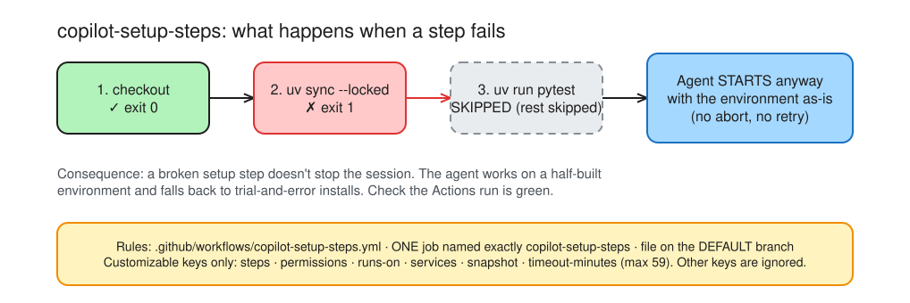
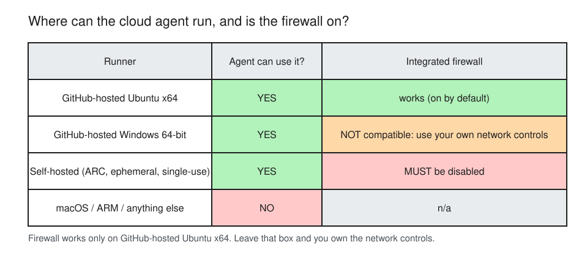
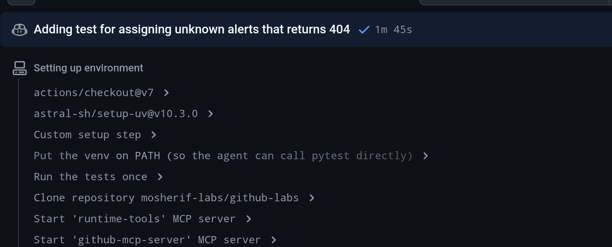
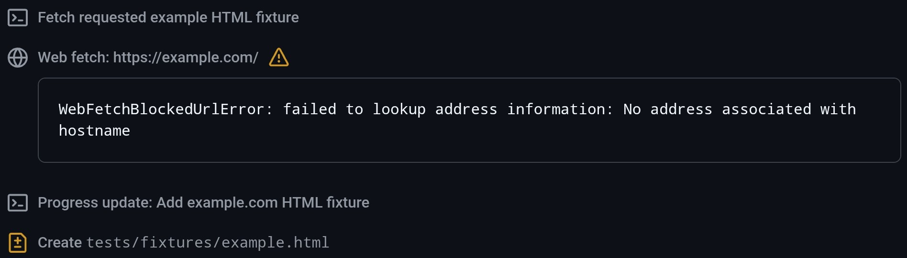
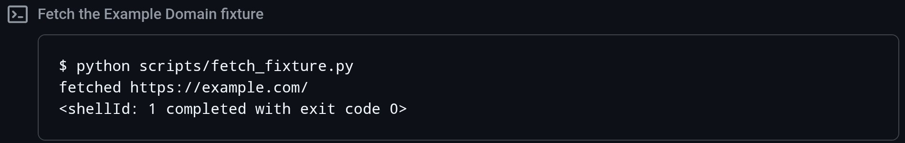
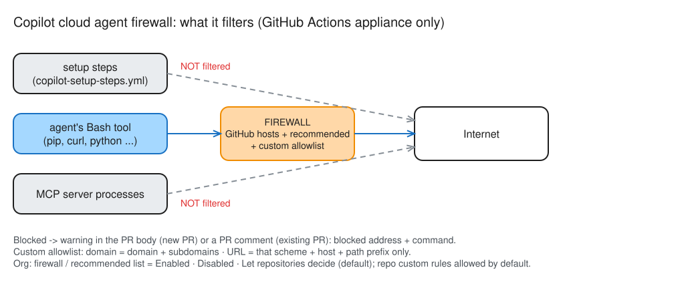
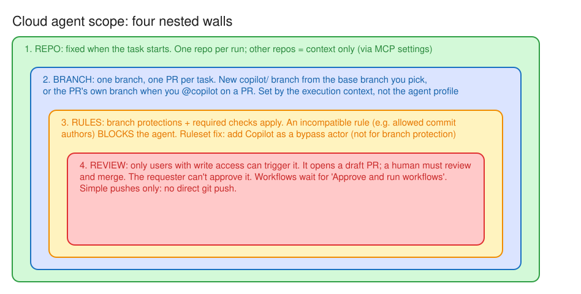

# Day 11 — Walls around the sandbox

> Break the agent's environment three ways (missing deps, a blocked host, a push it isn't allowed to make), then fix each one with the **right** setting, not the biggest hammer.

**Deliverable:** `notes/d11-env.md`: 3 environment failures, symptom → setting that fixes it

## Bets

- **Bet A** — One step in `copilot-setup-steps` exits non-zero. What does Copilot do? **My guess: Aborts the session**
  - Result: **Miss**: actual **skips the remaining setup steps and starts work** with the environment as it is. Docs: *"If any setup step fails by returning a non-zero exit code, Copilot will skip the remaining setup steps and begin working with the current state of its development environment."* ([Setup steps](https://docs.github.com/en/copilot/how-tos/copilot-on-github/customize-copilot/customize-cloud-agent/customize-the-agent-environment#customizing-copilots-development-environment-with-copilot-setup-steps))
- **Bet B** — Does the agent firewall apply to your **MCP server** processes and to **setup steps**? **My guess: Both**
  - Result: **Miss**: actual **Neither**. Docs: *"The firewall only applies to processes started by the agent via its Bash tool. It does not apply to Model Context Protocol (MCP) server processes or processes started in configured Copilot setup steps."* ([Limitations](https://docs.github.com/en/copilot/how-tos/copilot-on-github/customize-copilot/customize-the-firewall#limitations))

## Lessons (Mission 1 — Copilot setup steps)

Source: [Customizing Copilot's development environment with Copilot setup steps](https://docs.github.com/en/copilot/how-tos/copilot-on-github/customize-copilot/customize-cloud-agent/customize-the-agent-environment#customizing-copilots-development-environment-with-copilot-setup-steps)

*Editable source: [d11-setup-steps-failure.excalidraw](img/d11-setup-steps-failure.excalidraw)*

- File: `.github/workflows/copilot-setup-steps.yml`, with a **single** job
- Job name is not optional: *"The job MUST be called `copilot-setup-steps` or it will not be picked up by Copilot."*
- It must be on the **default branch** to take effect; it also runs as a normal Actions workflow when changed (`push`/`pull_request` on its path + `workflow_dispatch`), so you can see it pass
- Customizable keys only: `steps`, `permissions`, `runs-on`, `services`, `snapshot`, `timeout-minutes` (**max 59**). Other keys are ignored
- A failing step makes Copilot **skip the remaining setup steps** and start with the environment as it is: no abort, no retry. So a silent half-built environment is the failure mode; watch the Actions run
- Recall check: 3/4 (job name ✓, default branch ✓, max 59 ✓, failure behaviour ✗); re-test applied to a private-package `uv sync` failure ✓

**Preinstalling, runners, limits** ([Preinstalling](https://docs.github.com/en/copilot/how-tos/copilot-on-github/customize-copilot/customize-cloud-agent/customize-the-agent-environment#preinstalling-tools-or-dependencies-in-copilots-environment) · [Larger runners](https://docs.github.com/en/copilot/how-tos/copilot-on-github/customize-copilot/customize-cloud-agent/customize-the-agent-environment#upgrading-to-larger-github-hosted-github-actions-runners) · [Workflow limitations](https://docs.github.com/en/copilot/concepts/agents/cloud-agent/about-cloud-agent#limitations-in-copilot-cloud-agents-software-development-workflow))

*Editable source: [d11-runners-firewall.excalidraw](img/d11-runners-firewall.excalidraw)*

- Without preinstalled deps Copilot installs by **trial and error**: slow, unreliable (LLMs are non-deterministic), and it may be *"completely unable"* to fetch **private** packages. Setup steps make it deterministic
- If your steps don't check out the code, Copilot does it for you after the steps
- Runners via `runs-on` (e.g. `ubuntu-4-core`): *"only compatible with Ubuntu x64 Linux and Windows 64-bit runners"*; no macOS
- Integrated firewall is **not compatible with Windows** or **self-hosted** runners: self-hosted (ephemeral, single-use, via ARC or Runner Scale Set Client) means you **must disable** it and bring your own network controls
- Repo scope is fixed when the task **starts**: no changes across multiple repos in one run. Context from other repos only via repository **MCP settings**
- **One branch, exactly one PR** per task
- **59-minute** hard session limit, can't be extended; `timeout-minutes` only makes it **shorter**. Bigger work = split into smaller tasks
- Close-out check: 2/4 (preinstall ✓, 59 min ✓, runners ✗, self-hosted ✗); re-test 2/2 ✓

## Mission 4 — setup steps on `main`

- PR [#61](https://github.com/mosherif-labs/github-labs/pull/61) merged: `timeout-minutes: 30`, `setup-uv@v10.3.0` (plan said v10.2.0; v10.3.0 is newest, floating major tags stopped at v8), `.venv/bin` on `PATH`, tests run once
- `Copilot Setup Steps` run [38015671645](https://github.com/mosherif-labs/github-labs/actions/runs/38015671645) on `main` (push): ✓ in 16 s, **66 passed in 0.33s**
- Session-log check: issue [#62](https://github.com/mosherif-labs/github-labs/issues/62) (assign on unknown alert → 404; the plan's GET 404 test already existed) → PR [#63](https://github.com/mosherif-labs/github-labs/pull/63), session ✓ in **1m 45s**
- Session log, *Setting up environment*, in order: `actions/checkout@v7` → `astral-sh/setup-uv@v10.3.0` → *Custom setup step* (`uv sync --locked`) → *Put the venv on PATH* → *Run the tests once* → *Clone repository* → MCP servers `runtime-tools`, `github-mcp-server`, `playwright`. My setup steps run **first**, before Copilot's own clone and MCP start

## Mission 5 — blocked host

- `scripts/fetch_fixture.py` merged; issue [#65](https://github.com/mosherif-labs/github-labs/issues/65) asks the agent to run it and commit `tests/fixtures/example.html`
- PR [#66](https://github.com/mosherif-labs/github-labs/pull/66): the description says *"The fetch script could not reach `example.com` because DNS was unavailable, so the content was added locally."* ⚠️ The agent **worked around** the block: it wrote the fixture itself instead of stopping. The file is not the real download
- Repo **Settings → Copilot → Cloud agent → Internet access**: firewall **on**, recommended allowlist **on** (defaults). Blocked address `example.com`, command `python scripts/fetch_fixture.py`. No firewall warning box visible in the PR body; the block surfaced only as the agent's "DNS was unavailable" line
- Session log: after a Bash step *Fetch requested example HTML fixture*, the agent tried its **Web fetch** tool on `https://example.com/` → `WebFetchBlockedUrlError: failed to lookup address information: No address associated with hostname` → then **Create `tests/fixtures/example.html`** by hand. Open question: did the Bash step run the script and fail too (expand it)?

- Fix: repo **Settings → Copilot → Cloud agent → Internet access → Custom allowlist** → `example.com` (domain) → **Add rule** → **Save changes**
- Retry on PR #66 (`@copilot` told to run the script and not hand-write the file): `python scripts/fetch_fixture.py` → `fetched https://example.com/`, exit code 0; the agent replaced the hand-written fixture with the downloaded HTML. **Blocked → allowlisted → working**. PR #66 merged
- Lesson: when a fetch is blocked, the agent may **fabricate** the output and still open a green PR. Say "if it fails, stop" in the task, and check fixtures/data files in review

## Lessons (Mission 2 — The firewall)

Source: [Customizing or disabling the firewall for Copilot cloud agent](https://docs.github.com/en/copilot/how-tos/copilot-on-github/customize-copilot/customize-the-firewall#overview) (the old plan link `/how-tos/use-copilot-agents/cloud-agent/customize-the-agent-firewall` redirects here)

*Editable source: [d11-firewall-scope.excalidraw](img/d11-firewall-scope.excalidraw)*

- Internet access is limited by a firewall **by default** to cut exfiltration risk; GitHub hosts Copilot needs are always allowed
- Blocked request → **warning in the PR body** (new PR) or a **PR comment** (existing PR), naming the blocked address and the command
- Covers **only processes the agent starts via its Bash tool**: not MCP server processes, not setup steps ([Limitations](https://docs.github.com/en/copilot/how-tos/copilot-on-github/customize-copilot/customize-the-firewall#limitations))
- Only inside the GitHub Actions appliance; sophisticated attacks may bypass it: **not a complete security solution**
- Recommended allowlist (on by default): OS package repos, container registries, language package registries, certificate authorities, Playwright browser downloads ([Recommended allowlist](https://docs.github.com/en/copilot/how-tos/copilot-on-github/customize-copilot/customize-the-firewall#understanding-the-recommended-firewall-allowlist))
- Custom allowlist: repo **Settings → Copilot → Internet access → Custom allowlist → Add rule → Save changes**. A **domain** entry allows the domain + subdomains (`packages.contoso.corp` allows `prod.packages.contoso.corp`, not `artifacts.contoso.corp`); a **URL** entry allows only that scheme + host + path prefix ([Custom allowlist](https://docs.github.com/en/copilot/how-tos/copilot-on-github/customize-copilot/customize-the-firewall#managing-the-custom-allowlist))
- Org level: firewall and recommended allowlist = *Enabled* / *Disabled* / *Let repositories decide* (default); *Allow repository custom rules* is on by default, owners can disable it
- Check (after the summary): 2/3 (setup steps not filtered ✓, PR-body warning ✓, domain rule ✗: said any `*.contoso.corp`); domain-tree re-test ✓ (entry + everything below it, never siblings or the parent)

## Lessons (Mission 3 — Scope: repo, branch, secrets)

Sources: [Risks: the agent can push code](https://docs.github.com/en/copilot/concepts/agents/cloud-agent/risks-and-mitigations#copilot-cloud-agent-can-push-code-changes-to-your-repository) · [Compatibility limitations](https://docs.github.com/en/copilot/concepts/agents/cloud-agent/about-cloud-agent#limitations-in-copilot-cloud-agents-compatibility-with-other-features) · [Learn: branch-based scope](https://learn.microsoft.com/en-us/training/modules/agent-tooling-mcp-execution-environments/4-execution-context-boundaries#configure-an-agent-to-use-branch-based-scope)

*Editable source: [d11-scope-walls.excalidraw](img/d11-scope-walls.excalidraw)*

- The agent pushes to **one branch**: a new `copilot/` branch, or the PR's branch when you `@copilot` on an existing PR. Only *simple push operations*: no direct `git push`
- It's subject to **branch protections and required checks**; only users with **write access** can trigger it (others' comments never reach it)
- It opens a **draft** PR a human must review and merge; it can't mark it ready, approve or merge. The **requester can't approve** it. An unattributed PR needs an **extra approval** (on by default in rulesets, always for branch protection)
- Workflows don't run until someone with write access clicks **Approve and run workflows** (admins can allow auto-run)
- An **incompatible** ruleset or branch protection rule (e.g. only specific commit authors) **blocks** the agent. With **rulesets** you can add **Copilot as a bypass actor**; the doc names no such fix for classic branch protection
- You pick a **base branch** when delegating; the agent branches from it. Branch scope is enforced by the **execution context**, not the custom agent profile
- ⚠️ The Learn unit shows `applyTo` in an `.agent.md`; the [custom agents configuration reference](https://docs.github.com/en/copilot/reference/custom-agents-configuration#yaml-frontmatter-properties) doesn't list it. Trust the reference
- Check: 3/3 (requester can't approve ✓, bypass actor ✓, execution context sets the branch ✓)

## Three failures

| Failure | Symptom (where I saw it) | Setting that fixes it | Level | Risk of the fix |
|---|---|---|---|---|
| Missing deps | Without setup steps the agent installs by trial and error (slow, fails on private packages); a failing setup step is **skipped silently** and the agent starts anyway. Fixed: session log of [#63](https://github.com/mosherif-labs/github-labs/pull/63) shows my steps first, `66 passed` | `.github/workflows/copilot-setup-steps.yml` on the **default branch**, job `copilot-setup-steps` | Repo | Setup steps run **outside the firewall**: a malicious dependency installed there can reach any host |
| Blocked host | Session log of [#66](https://github.com/mosherif-labs/github-labs/pull/66): `WebFetchBlockedUrlError` (DNS lookup failed); no warning box in the PR body; the agent **hand-wrote** the fixture | Firewall **custom allowlist**: `example.com` as a domain | Repo (org can disable repo custom rules or set the firewall itself) | A domain entry opens the domain **and all subdomains**; every entry is a new exfiltration path |
| Push blocked | Not run (Mission 6 skipped). Docs: an incompatible ruleset/branch protection **blocks** the agent from creating or updating PRs | Ruleset **bypass actor** (Copilot) or a narrower **branch pattern** | Repo or org ruleset | Bypass widens Copilot's power on protected branches; a narrower pattern drops protection for **everyone** on `copilot/` |

**Agent secrets/variables:** repo **Settings → Secrets and variables → Agents** (a separate type from Actions secrets; Actions secrets are **not** passed to the agent). Only secrets named `COPILOT_MCP_*` reach the MCP config, and not as normal env vars ([Docs](https://docs.github.com/en/copilot/how-tos/copilot-on-github/customize-copilot/customize-cloud-agent/configure-secrets-and-variables#naming-requirements-for-secrets-and-variables))

## Ruleset trade-off

*Mission 6 hands-on skipped by choice (no `copilot/**` ruleset was created, so nothing to clean up; `main`'s ruleset untouched). Facts from the docs: an incompatible ruleset or branch protection rule **blocks** the agent; with **rulesets** you can add Copilot as a **bypass actor** ([Compatibility limitations](https://docs.github.com/en/copilot/concepts/agents/cloud-agent/about-cloud-agent#limitations-in-copilot-cloud-agents-compatibility-with-other-features)).*

- **More control:** bypass actor. The ruleset still covers `copilot/` branches; only Copilot is exempt
- **Easier to audit:** bypass actor. One named exception on the ruleset
- **My bank's change-management team would prefer:** narrowing the branch pattern

## Repo scope probe

- Prediction (before assigning): **1 PR, in `github-labs` only**; the `mcp-registry` part is skipped
- Probe issue: [#59](https://github.com/mosherif-labs/github-labs/issues/59) (assigned to Copilot 2026-10-09)
- Result: **prediction right**. One PR, [#60](https://github.com/mosherif-labs/github-labs/pull/60), in `github-labs` only. Its description: *"Added the note to `github-labs/README.md`. The `mcp-registry` README is not included in this change."* It says what it skipped, but not **why**
- Doc sentence: *"Copilot can only make changes in the repository specified when you start a task."* ([Workflow limitations](https://docs.github.com/en/copilot/concepts/agents/cloud-agent/about-cloud-agent#limitations-in-copilot-cloud-agents-software-development-workflow))
- More **context** (not write access) from other repos: configure broader access through the repository's **MCP settings** (the GitHub MCP server is scoped to the current repo by default)

## Reflection
