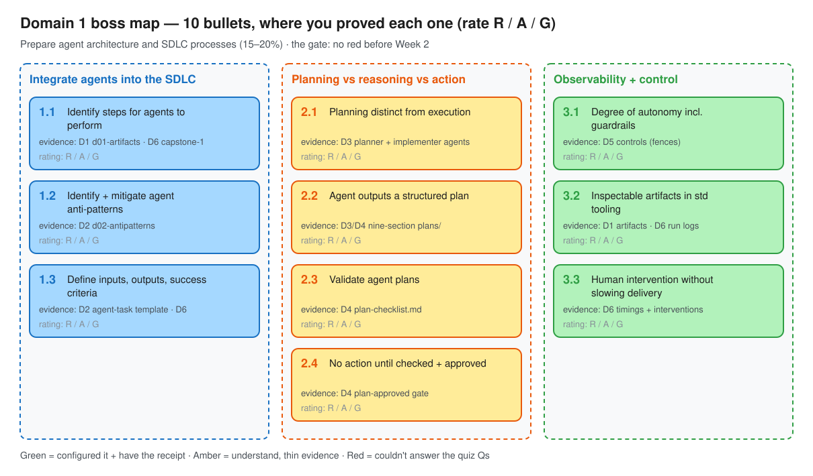
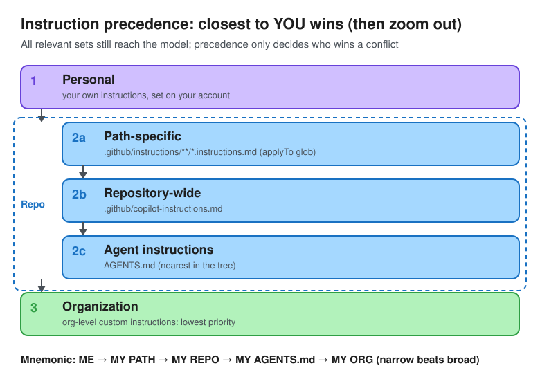

# Day 7 — Boss Fight: Week 1 review

> Twenty questions you write yourself, answered with the docs shut. The gate: **every Domain 1 bullet amber or green** before Week 2 hands the agent real tools.

**Deliverable:** 20 self-quiz questions on Domain 1 answered closed-book · every Domain 1 bullet rated red/amber/green in the **GH-600 objectives** issue · [`gap-log.md`](gap-log.md) updated

*Source: [`img/d07-domain1-map.excalidraw`](img/d07-domain1-map.excalidraw), open it in excalidraw.com to edit*

## Questions (Mission 2)

Source: [Study guide GH-600 — Skills measured](https://learn.microsoft.com/en-us/credentials/certifications/resources/study-guides/gh-600#skills-measured), *Prepare agent architecture and SDLC processes (15–20%)* only. 2 per bullet, written from the docs and this week's notes. Answers are in the **Answer key** at the very bottom.

### Integrate agents into the SDLC

**1.1 Identify steps for agents to perform**

- **Q1.** Your team wants to hand `github-labs` work to Copilot cloud agent. Which task is the **best fit** for the agent?
  - A. Raise the alert threshold in `app/screening.py` from 50 to 60
  - B. Rename the `alert_id` field across this repo and two consumer repos
  - C. Add tests for each `/alerts/{id}/close` disposition
  - D. Update `ci.yml` to deploy to production on merge
- **Q2.** Under *agents propose; humans and policy accept*, which SDLC stage is **usually restricted** for agents and gated by environment approvals?
  - A. Deployment
  - B. Planning
  - C. Validation
  - D. Implementation

**1.2 Identify and mitigate common anti-patterns in agents**

- **Q3.** An issue says only *"make alerts better"*. Copilot's PR blocks notes on closed alerts: small, tested, and nobody asked for it. Which anti-pattern is this, and what prevents it?
  - A. Scope creep; restrict the agent's tools
  - B. Hidden reasoning; enable session logs
  - C. Vague scope (the agent picks its own problem); an issue template with context, expected output and acceptance criteria
  - D. Too many tools; an MCP allowlist
- **Q4.** A reviewer merges an agent PR because *"CI passed"*, but the only tests that ran were the ones the agent wrote. Which control **best** mitigates this?
  - A. Independent required status checks it didn't author (CI, CodeQL) plus CODEOWNERS with required review
  - B. Switch to a stronger model
  - C. Ask the agent to write more tests
  - D. Add *"be careful"* to `AGENTS.md`

**1.3 Define inputs, outputs, and success criteria for agents**

- **Q5.** In Learn's *vulnerability remediation* task contract, which item belongs under **Inputs**?
  - A. Rollback/escalation path recorded
  - B. A PR containing a structured plan and bounded changeset
  - C. Repository scope (`src/` allowed, `infra/` restricted) and constraints (no workflow changes, no secrets)
  - D. Required checks pass (build/test/lint)
- **Q6.** Where should an agent task's success criteria be **enforced**?
  - A. In `.github/copilot-instructions.md`
  - B. In the agent's PR summary
  - C. As required status checks (rulesets / branch protection) that block merge until they pass
  - D. In the agent's final self-review step

### Define boundaries between planning, reasoning, and action

**2.1 Configure agent planning to be distinct from agent execution**

- **Q7.** You need a planner agent that **cannot** change files whatever the prompt says, but can still read the code. Which profile does it?
  - A. `disable-model-invocation: true`
  - B. `tools: []` plus *"only plan"* in the body
  - C. Body says *"Never edit files"*, `tools` omitted
  - D. `tools: ["read", "search"]`
- **Q8.** An agent profile **omits** the `tools` property. What can the agent use?
  - A. Only MCP tools
  - B. No tools
  - C. All available tools
  - D. Read-only tools

**2.2 Configure an agent to output a structured plan**

- **Q9.** A PR template asks every agent PR for a Plan section. What turns *"include a plan"* into a **guarantee**?
  - A. Labelling the PR `plan`
  - B. CODEOWNERS on the template file
  - C. A workflow that verifies the plan, set as a **required status check** in a ruleset
  - D. Adding *"always fill the template"* to the agent profile
- **Q10.** Which is **not** a section of the Plan in Learn's structured-plan PR template?
  - A. Model and token budget
  - B. Success criteria (verifiable)
  - C. Rollback / escalation plan
  - D. Risks and mitigations

**2.3 Validate agent plans**

- **Q11.** Asked for a Dockerfile under `infra/`, the planner returns a polished nine-section plan adding locks to three routers, with no mention of `infra/`. Which validation rule catches it?
  - A. `infra/` must not appear in *Files to change*
  - B. Every file in the plan is justified by the issue
  - C. All nine headings are present in order
  - D. CI passes on the plan PR
- **Q12.** When is a **plan-first PR** (plan only, no code) the better choice over plan + execution?
  - A. When speed matters most
  - B. A change to screening thresholds, workflows or `infra/`
  - C. A dependency bump with green CI
  - D. A low-risk docs fix

**2.4 Prevent agent action until the agent checked and approved**

- **Q13.** A workflow on `issues: assigned` comments *"plan not approved"* when the `plan-approved` label is missing. Copilot is assigned without the label. What happens?
  - A. The session starts anyway; the workflow can only signal after the fact
  - B. The workflow cancels Copilot's Actions run
  - C. The label is added automatically
  - D. The agent session is blocked
- **Q14.** Copilot opens a PR and your CI **doesn't run**. Why, and what do you do?
  - A. Workflows don't run automatically on Copilot's pushes; a user with write access clicks **Approve and run workflows**
  - B. Copilot disables Actions; re-enable them in settings
  - C. The `copilot/` branch prefix is excluded; rename the branch
  - D. The ruleset blocks bots; add a bypass

### Configure observability and control for autonomous agents

**3.1 Plan and implement the degree of agent autonomy, including guardrails**

- **Q15.** Under Learn's autonomy tiers, an agent change to `.github/workflows/` should get:
  - A. CODEOWNERS + multiple reviews + stricter rulesets
  - B. Automerge after required checks
  - C. No review; environments catch it later
  - D. PR + checks + at least 1 review
- **Q16.** Your `main` ruleset only allows specific commit authors and blocks Copilot cloud agent. The documented fix?
  - A. Convert the ruleset into a branch protection rule
  - B. Give Copilot admin access
  - C. Delete the ruleset
  - D. Add Copilot as a **bypass actor** in the ruleset

**3.2 Configure agent to produce inspectable artifacts within standard development tooling**

- **Q17.** An auditor asks how a Copilot commit links back to the agent's reasoning. What's true?
  - A. Only the org audit log records it
  - B. Each commit message links to the session logs; Copilot authors it with the requester as co-author
  - C. Only the PR description has it
  - D. It isn't recorded
- **Q18.** Which is **not** part of Learn's minimum audit trail for agent work?
  - A. A bounded changeset
  - B. The model's full hidden chain-of-thought transcript
  - C. A clear outcome (merge, revert or escalation)
  - D. An inspectable plan

**3.3 Configure human intervention for autonomous agents without slowing delivery**

- **Q19.** Mid-session you notice the agent should also return 404 for unknown ids. Fastest documented way to correct it **without stopping** it?
  - A. Stop the session and reassign the issue
  - B. Close the PR and open a new issue
  - C. Edit the issue body
  - D. Type a follow-up in the session's prompt box (steering; costs AI credits)
- **Q20.** Solo dev, ruleset needs 1 approval. You asked Copilot for the PR, then approve it yourself. What happens?
  - A. It counts after re-running workflows
  - B. Your approval counts and it merges
  - C. It doesn't count: the person who asked Copilot can't approve its PR; you need another reviewer or a bypass
  - D. It counts if you're in CODEOWNERS

## Score (Missions 3–4)

Answer on paper in 20 min with the key hidden, then fill this in. Confidence: **sure / guessed / blank**.

| Q | Bullet | My answer | Key | Confidence | ✓/✗ |
|---|---|---|---|---|---|
| 1 | 1.1 | C | C | sure | ✓ |
| 2 | 1.1 | A | A | sure | ✓ |
| 3 | 1.2 | C | C | sure | ✓ |
| 4 | 1.2 | A | A | sure | ✓ |
| 5 | 1.3 | C | C | sure | ✓ |
| 6 | 1.3 | A | C | sure | ✗ |
| 7 | 2.1 | D | D | sure | ✓ |
| 8 | 2.1 | C | C | sure | ✓ |
| 9 | 2.2 | C | C | sure | ✓ |
| 10 | 2.2 | A | A | sure | ✓ |
| 11 | 2.3 | A | B | sure | ✗ |
| 12 | 2.3 | B | B | sure | ✓ |
| 13 | 2.4 | A | A | sure | ✓ |
| 14 | 2.4 | A | A | sure | ✓ |
| 15 | 3.1 | A | A | sure | ✓ |
| 16 | 3.1 | D | D | sure | ✓ |
| 17 | 3.2 | C | B | sure | ✗ |
| 18 | 3.2 | B | B | sure | ✓ |
| 19 | 3.3 | D | D | sure | ✓ |
| 20 | 3.3 | C | C | sure | ✓ |
| | | | | **Score** | **17/20** |

Every ✗ or *guessed* → one row in [`gap-log.md`](gap-log.md).

## Know cold (Mission 4)

Answered closed-book (multiple choice), then checked against the docs. **2/3.**

1. **Instruction-file precedence** — ✗ I said *personal > organization > repository*. Correct: **personal > repository (path-specific > repo-wide > `AGENTS.md`) > organization**, and **all** relevant sets still reach the model; precedence only decides conflicts
   - Check: [Precedence of custom instructions](https://docs.github.com/en/copilot/concepts/prompting/response-customization#precedence-of-custom-instructions)

   

   *Retest: ✗ (picked org) → explained via Spring config overrides (most specific wins; orgs **enforce** with rulesets/policies, not instructions) → retest 2 ✓*

   *Source: [`img/d07-precedence.excalidraw`](img/d07-precedence.excalidraw). Mnemonic: **me → my path → my repo → my AGENTS.md → my org** (narrow beats broad)*
2. **Custom instructions vs custom agents vs skills** — ✓ Instructions = **always-on context** · custom agents = **specialized Copilot** with its own prompt, tools, model, MCP servers in `.github/agents/*.agent.md` · skills = **folders** of instructions, scripts and resources loaded **only when relevant** (project: `.github/skills`, `.claude/skills`, `.agents/skills`; personal: `~/.copilot/skills`, `~/.agents/skills`)
   - Check: [About agent skills](https://docs.github.com/en/copilot/concepts/agents/about-agent-skills#about-agent-skills)
3. **Human checkpoints without approving every step** — ✓ **Gate by risk, not by step**: plan-first review only for high-risk paths · required checks instead of manual approvals for low risk · CODEOWNERS routes `infra/` + workflows · environments pause only critical jobs · steer (session prompt box / `@copilot`) instead of stopping
   - Check: Day 4 [`plan-checklist.md`](plan-checklist.md) · Day 6 [`capstone-1.md`](capstone-1.md) · [Learn — autonomy must be designed](https://learn.microsoft.com/en-us/training/modules/design-agent-architecture-integration/6-reliable-workflows#autonomy-must-be-designed-not-assumed)

## Domain 1 ratings (Mission 5)

Mirror of the **GH-600 objectives** issue. **Green** = configured it this week + have the evidence · **Amber** = understand it, evidence thin · **Red** = couldn't answer the quiz questions on it.

| # | Bullet | Rating | Evidence |
|---|---|---|---|
| 1.1 | Identify steps for agents to perform | 🟢 green | [`d01-artifacts.md`](d01-artifacts.md) · [`capstone-1.md`](capstone-1.md) |
| 1.2 | Identify and mitigate common anti-patterns | 🟢 green | [`d02-antipatterns.md`](d02-antipatterns.md) |
| 1.3 | Inputs, outputs, success criteria | 🟢 green (Q6 ✗ → re-quiz 2/2) | [`d02-antipatterns.md`](d02-antipatterns.md) (template fields) |
| 2.1 | Planning distinct from execution | 🟢 green | [`d03-agents.md`](d03-agents.md) |
| 2.2 | Structured plan output | 🟢 green | [`d03-agents.md`](d03-agents.md) · [`plans/`](plans/) |
| 2.3 | Validate agent plans | 🟢 green (Q11 ✗ → re-quiz 2/2) | [`plan-checklist.md`](plan-checklist.md) |
| 2.4 | No action until checked + approved | 🟢 green | [`d04-plan-gate.md`](d04-plan-gate.md) |
| 3.1 | Degree of autonomy + guardrails | 🟢 green (`d05-controls.md` restored) | [`d05-controls.md`](d05-controls.md) |
| 3.2 | Inspectable artifacts | 🟢 green (Q17 ✗ → re-quiz 2/2) | [`d01-artifacts.md`](d01-artifacts.md) · [`capstone-1.md`](capstone-1.md) |
| 3.3 | Human intervention without slowing delivery | 🟢 green | [`capstone-1.md`](capstone-1.md) |

## Amber re-quiz

Six new questions (2 per amber bullet), aimed at the misconception behind each miss. **6/6 → all three green.**

| Bullet | Question | Answer | ✓ | Doc |
|---|---|---|---|---|
| 1.3 | PR summary says "criteria met", ruleset has no checks: what enforces success? | Make the test/lint workflow a **required status check** | ✓ | [Learn — task contract](https://learn.microsoft.com/en-us/training/modules/design-agent-architecture-integration/3-inputs-outputs-success-criteria#example-task-contract-vulnerability-remediation) |
| 1.3 | "Rollback/escalation path recorded" sits under…? | **Success criteria** | ✓ | [Learn — task contract](https://learn.microsoft.com/en-us/training/modules/design-agent-architecture-integration/3-inputs-outputs-success-criteria#example-task-contract-vulnerability-remediation) |
| 2.3 | Pagination plan also "tidies" `app/screening.py`; `infra/` out of scope, nine headings | **Reject**: file not justified by the issue (and high-risk) | ✓ | [`plan-checklist.md`](plan-checklist.md) §2 |
| 2.3 | What validates a plan before any code in plan-first? | **Human review of the plan PR + merge/label** as the go-ahead | ✓ | [Learn — plan-first PR](https://learn.microsoft.com/en-us/training/modules/design-agent-architecture-integration/4-plan-reason-execution#option-a-plan-first-pull-request) |
| 3.2 | Where are the agent's reasoning, tool calls and test runs? | **Session logs** (Agents tab / session view) | ✓ | [Docs — manage and track agents](https://docs.github.com/en/copilot/how-tos/copilot-on-github/use-copilot-agents/manage-and-track-agents) |
| 3.2 | Where does the agent's ephemeral environment show up? | **GitHub Actions** workflow run | ✓ | [`d01-artifacts.md`](d01-artifacts.md) · [MS Learn — SDLC artifacts](https://learn.microsoft.com/en-us/training/modules/design-agent-architecture-integration/2-agent-responsibilities#mapping-sdlc-stages-to-github-artifacts) |

## Reds → ambers (Mission 7)

For each red: doc section from the gap log · smallest exercise redone · new rating.

> **Gate:** all Domain 1 bullets amber or green before Week 2. A surviving red gets Monday time before Day 8; fallback is moving GH-600 from Sun Oct 25 to Sun Nov 1.

| Bullet | Exercise redone | New rating |
|---|---|---|
| — | No reds: gate passed | — |

## Done when

- [x] 20 self-quiz questions on Domain 1 written from the study-guide bullets and answered closed-book
- [x] Every Domain 1 bullet rated red/amber/green in the objectives issue
- [x] `notes/gap-log.md` updated
- [x] Know cold: instruction-file precedence; custom instructions vs custom agents vs skills; human checkpoints without approving every step
- [x] **Gate: all Domain 1 bullets amber or green**

## Reflection

- What's the one Week 1 idea I'll still know in 6 months?
  - **Gate by risk, not by step**: autonomy is set per path. Automerge docs, plan-first + checklist for thresholds, `infra/` and workflows
- Financial-crime angle: which Week 1 control would I propose first to my own team, and who would object?
  - **Read-only planner agent** (`tools: ["read", "search"]`): the planner *can't* change screening code whatever the prompt says. Objection: developers ("just let it fix it")
- What should Week 2 do differently?
  - **Re-quiz misses the next day**: turn every gap-log row into a flashcard and re-test the next morning

          

---

## Answer key

*Don't scroll here until Mission 4.*

| Q | Answer | Why (one line) | Doc link |
|---|---|---|---|
| 1 | **C** | Narrow, testable, easy to verify. Thresholds = compliance policy, deploy-on-merge = CI/production risk, cross-repo = one repo per task | [doc](https://docs.github.com/en/copilot/tutorials/cloud-agent/get-the-best-results#choosing-the-right-type-of-tasks-to-give-to-copilot) |
| 2 | **A** | Deployment maps to environments + deployment approvals; agents draft plans, open PRs and iterate on checks | [doc](https://learn.microsoft.com/en-us/training/modules/design-agent-architecture-integration/2-agent-responsibilities#mapping-sdlc-stages-to-github-artifacts) |
| 3 | **C** | Day 2: vague scope caused *scope substitution*, not creep; template fields are the fix | [doc](https://learn.microsoft.com/en-us/training/modules/foundations-agentic-ai/5-identify-risks-traceability#common-risks-and-anti-patterns) |
| 4 | **A** | Agents don't grade their own work: success is enforced by the system and humans, not assumed | [doc](https://learn.microsoft.com/en-us/training/modules/design-agent-architecture-integration/3-inputs-outputs-success-criteria#example-task-contract-vulnerability-remediation) |
| 5 | **C** | Inputs = context, constraints, boundaries. Checks passing and rollback recorded are success criteria; the PR is an output | [doc](https://learn.microsoft.com/en-us/training/modules/design-agent-architecture-integration/3-inputs-outputs-success-criteria#example-task-contract-vulnerability-remediation) |
| 6 | **C** | *Success is enforced by the system, not assumed by the agent* | [doc](https://learn.microsoft.com/en-us/training/modules/design-agent-architecture-integration/3-inputs-outputs-success-criteria#example-task-contract-vulnerability-remediation) |
| 7 | **D** | Tool allowlist = enforcement. Body text is only guidance; `[]` removes read too, so it can't read code; `disable-model-invocation` only stops auto-selection | [doc](https://docs.github.com/en/copilot/reference/custom-agents-configuration#tools) |
| 8 | **C** | Omitted or `["*"]` = all tools; `[]` = none | [doc](https://docs.github.com/en/copilot/reference/custom-agents-configuration#tools) |
| 9 | **C** | A template only asks; a required check enforces. (Check the PR's changed files, not that the template exists) | [doc](https://learn.microsoft.com/en-us/training/modules/design-agent-architecture-integration/5-pull-request-governance-controls#implementation-pr-template-that-requires-a-structured-plan) |
| 10 | **A** | Template: Goal · Scope · Steps · Success criteria · Risks + mitigations · Rollback / escalation, plus Evidence | [doc](https://learn.microsoft.com/en-us/training/modules/design-agent-architecture-integration/5-pull-request-governance-controls#implementation-pr-template-that-requires-a-structured-plan) |
| 11 | **B** | Day 4: silent task substitution passes the `infra/` check, the heading check and CI; only scope-vs-issue catches it | [doc](https://learn.microsoft.com/en-us/training/modules/design-agent-architecture-integration/4-plan-reason-execution) |
| 12 | **B** | Plan-first for high-risk or hard-to-reverse work; the question is *when* code is allowed, not *whether* it's reviewed | [doc](https://learn.microsoft.com/en-us/training/modules/design-agent-architecture-integration/4-plan-reason-execution#option-a-plan-first-pull-request) |
| 13 | **A** | The event fires after assignment. Real locks: merge-side (required review/checks, CODEOWNERS) and who can assign | [doc](https://docs.github.com/en/actions/reference/workflows-and-actions/events-that-trigger-workflows#issues) |
| 14 | **A** | Workflows can be privileged and hold secrets, so they wait for approval (configurable) | [doc](https://docs.github.com/en/copilot/how-tos/copilot-on-github/use-copilot-agents/review-copilot-output#manage-github-actions-workflow-runs) |
| 15 | **A** | Low = docs (automerge) · Medium = src/deps · **High = infra/, workflows** · Critical = prod/secrets (environment approvals) | [doc](https://learn.microsoft.com/en-us/training/modules/design-agent-architecture-integration/6-reliable-workflows#autonomy-must-be-designed-not-assumed) |
| 16 | **D** | The documented fix is for rulesets: add Copilot as a bypass actor. Bypass widens autonomy, so scope it | [doc](https://docs.github.com/en/copilot/concepts/agents/cloud-agent/about-cloud-agent#limitations-in-copilot-cloud-agents-compatibility-with-other-features) |
| 17 | **B** | Trace commits to session logs | [doc](https://docs.github.com/en/copilot/how-tos/copilot-on-github/use-copilot-agents/manage-and-track-agents#trace-commits-to-session-logs) |
| 18 | **B** | Trail: stated goal · inspectable plan · bounded changeset · automated evidence · human judgment · clear outcome | [doc](https://learn.microsoft.com/en-us/training/modules/foundations-agentic-ai/5-identify-risks-traceability#traceability-and-observability) |
| 19 | **D** | Steer without stopping; **Stop session** keeps pushed commits but ends the run | [doc](https://docs.github.com/en/copilot/how-tos/copilot-on-github/use-copilot-agents/manage-and-track-agents#steer-an-agent-session) |
| 20 | **C** | Independent review is built in; that trade-off is the exam's *intervention without slowing delivery* | [doc](https://docs.github.com/en/copilot/concepts/agents/cloud-agent/risks-and-mitigations#copilot-cloud-agent-can-push-code-changes-to-your-repository) |
